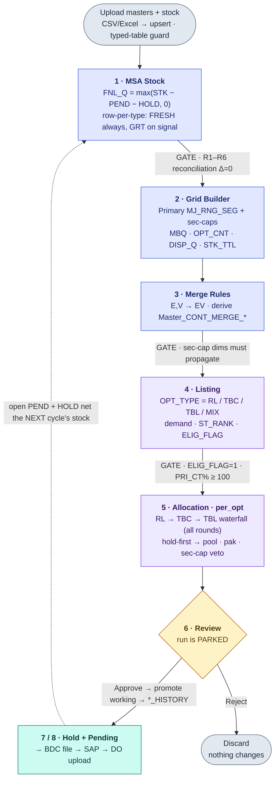

# ARS V2 Retail — End-to-End Business Requirements Document (BRD)

**System:** V2 Retail Auto Replenishment System (ARS)
**Scope:** Full pipeline — from raw master/stock ingestion to the SAP-ready BDC / Delivery-Order feedback loop
**Owner:** Akash Agarwal, Director — V2 Retail
**Scale:** 320+ stores · 242 major categories · replaces a legacy 20-machine Excel process
**Source of truth:** `frontend/public/docs/manual/*.md` (in-app at `/manual/*`), `docs/RULE_MASTER.md`, and the engine code under `backend/app/services/` + `backend/app/api/v1/endpoints/`
**Status:** consolidated reference (July 2026 code state — 12-step MSA, per_opt-only engine, typed FRESH/GRT pools)

---

## 1. Document Purpose

This BRD describes **what ARS does, why, and by which rules**, walking the whole system in pipeline order — the *very start* (uploading master data and warehouse stock) to the *end point* (a BDC file uploaded to SAP and settled by Delivery Orders). It captures:

- **Every required master** and where it is consumed (§4).
- **All abbreviations** used across the system (§3).
- **Rules, algorithms, formulas, and conditions** per module (§6–§13).
- **Workflow charts** for the overall pipeline and each module.
- **Cross-cutting invariants** that a correct run must never violate (§14).

> ⚠️ Where this document and code disagree, **the code and the `/manual/*` dossiers win** — update this document to match.

---

## 2. Executive Summary — What ARS Decides

ARS answers one question, automatically, at scale: **what stock should go to which store, and how many pieces of each size.**

The system is a single ordered pipeline. Each stage feeds the next; rules apply at every boundary:

```
┌────────────┐  ┌─────────────┐  ┌────────────┐  ┌────────────┐  ┌──────────┐  ┌──────────────┐  ┌────────┐  ┌────────────────┐
│ 0. INGEST  │→ │ 1. MSA STOCK│→ │ 2. GRID    │→ │ 3. MERGE   │→ │ 4.LISTING│→ │ 5. ALLOCATION│→ │6.REVIEW│→ │ 7. HOLD /      │
│ masters +  │  │ free stock  │  │ BUILDER    │  │ RULES      │  │ classify │  │ per-OPT      │  │ approve│  │ 8. PENDING →   │
│ stock CSV  │  │ (FNL_Q)     │  │ (MBQ,grids)│  │ (pool budg)│  │ OPT_TYPE │  │ engine ship │  │ /reject│  │ BDC → SAP DO   │
└────────────┘  └─────────────┘  └────────────┘  └────────────┘  └──────────┘  └──────────────┘  └────────┘  └────────────────┘
   upload         ARS_MSA_*        ARS_GRID_*      MERGE_<col>    ARS_LISTING   ARS_ALLOC_       history    ARS_PEND_ALC /
   Master_*       GEN/VAR/TOTAL    HIERARCHY       Master_CONT_   _WORKING      WORKING /        promoted   ARS_NL_TBL_HOLD_
                                                   MERGE_<col>                  ARS_LISTED_OPT              TRACKING / BDC
```

**Business objectives**

- **BO-1** Eliminate manual Excel replenishment across 20 PCs → 100% of categories processed in ARS.
- **BO-2** Stock is never double-allocated → zero negative `FNL_Q`; no duplicate pending per grain.
- **BO-3** Respect category budgets (MBQ) and growth rules → allocations capped at `MJ_MBQ × cap_pct`; no per-`OPT_TYPE` growth abuse.
- **BO-4** Provide a fully auditable trail raw stock → MSA → listing → allocation → SAP DO.
- **BO-5** Allow human review and cancellation before SAP submission (park → approve/reject).
- **BO-6** Complete a 320-store × 242-MAJ_CAT cycle inside the operational window.

---

## 3. Abbreviations & Glossary (complete)

### 3.1 Core units & entities
| Abbr | Full form / meaning |
|---|---|
| **ARS** | Auto Replenishment System |
| **OPT** | Option — one allocation unit = `(WERKS, MAJ_CAT, GEN_ART_NUMBER, CLR)`; one style+colour of an article at one store |
| **OPT_TYPE** | Exactly one of **RL / TBC / TBL / MIX** per OPT per run (mutually exclusive at OPT grain) |
| **WERKS** | Store code (SAP plant); the ship-**to** store. Equals `ST_CD` in allocation history |
| **RDC** | Regional Distribution Centre — the source warehouse; ship-**from**. Formerly `ST_CD` in raw stock (renamed after MSA pivot) |
| **ST_CD** | Store code in raw/master data (context: destination store in pend ledger; warehouse axis pre-rename in MSA) |
| **MAJ_CAT** | Major category — the planning unit (e.g. `M_TEES_HS`). 242 active categories |
| **GEN_ART / GEN_ART_NUMBER** | Generic article — colour-level / style number |
| **VAR_ART** | Variant article — style + size (SKU) |
| **CLR** | Colour code (default `'A'` when missing) |
| **SZ** | Size (default `'A'`/`0` when missing) |
| **SEG** | Segment — filtered to `APP` (apparel) + `GM` (general merchandise) |
| **SLOC** | Storage location (shelf) within an RDC |
| **ATT_TYP** | SAP article category — `00` single, `02` variant (kept); `01` generic header, `11` structured/prepack (dropped) |

### 3.2 Stock, demand & budget metrics
| Abbr | Full form / meaning |
|---|---|
| **STK / STK_QTY / STK_TTL** | Stock quantity (total across selected SLOCs) |
| **PEND / PEND_QTY** | Pending — approved but not-yet-dispatched allocation reserved against stock |
| **HOLD / HOLD_QTY / HOLD_REM** | Held stock reserved at RDC for a store; `HOLD_REM` = still on hold |
| **FNL_Q** | **Free-to-allocate quantity** = `max(STK − PEND − HOLD, 0)` — never negative |
| **FNL_Q_REM** | Live pool remaining **after** an OPT's draw (per-OPT engine) |
| **MBQ** | Minimum / Merchandise Budget Quantity — pieces a store should hold at a grain. `MBQ=0` = *no constraint here*, not "ship zero" |
| **MJ_MBQ** | MAJ_CAT-level (Primary) MBQ roll-up |
| **SZ_MBQ** | Size-level MBQ |
| **OPT_MBQ / OPT_REQ** | Option target / requirement (`OPT_REQ = max(0, OPT_MBQ − STK_TTL)`) |
| **`*_MBQ_ORIG` / `*_MBQ_REV`** | Pre-growth (snapshot) / post-growth grid budget |
| **REQ** | Requirement (`MBQ − STK`, floored at 0) |
| **I_ROD** | Ideal Rounds Of Dispatch (how many MBQ multiples to ship) |
| **PAK** | Pack / multiple constraint at size grain |
| **CONT** | Contribution — share of budget for a grain (from `Master_CONT_<dim>`) |
| **ACS_D** | Accessories density — one OPT's *display* quantity. **NOT daily sale** |
| **MAX_DAILY_SALE** | True velocity metric used for replenishment math |
| **ALC_D** | Total sale-cover days = `INT_DAYS + PRD_DAYS + SL_CVR` |
| **SAL_PD** | Per-day sale (blended current-month CM + next-month NM) |
| **DISP_Q** | Effective display quantity |
| **OPT_CNT** | Option count at a grid grain |
| **STR** | Days of stock cover |
| **RNG_SEG** | MRP tier — `E` essential / `V` value / `P` premium / `SP` super-premium |

### 3.3 Classifications, grids & flags
| Abbr | Full form / meaning |
|---|---|
| **RL** | Replenish (live) — adequate display + fresh MSA supply; standard top-up |
| **TBC** | To-Be-Continued/Checked — low positive stock + supply available; partial top-up |
| **TBL** | To-Be-Listed — zero/negative stock + supply available; fresh launch (holds a ramp-up buffer) |
| **NL** | New Launch — new merchandise held back at WH for ramp-up |
| **MIX** | Clearance / insufficient supply / too few sizes — rolled up, not allocated |
| **FAB** | Fabric (sec-cap grid dimension) |
| **MACRO_MVGR / MICRO_MVGR** | Macro / Micro Merchandise Vendor Group (sec-cap dims) |
| **M_VND_CD** | Merchandise vendor code (sec-cap dim) |
| **MJ_RNG_SEG** | Primary grid = MAJ_CAT × RNG_SEG |
| **GH_<grid> / H_<grid>** | Grid applies to MAJ_CAT (0/1) / grid applies AND has requirement |
| **PRI_CT% / SEC_CT%** | Primary / secondary grid coverage % = `Σ H / Σ GH × 100` |
| **ALLOC_FLAG** | Allocation-eligible (`PRI_CT% ≥ 100`) |
| **ELIG_FLAG / ELIG_REASON** | Eligibility AND-gate result / first failing gate |
| **ALLOC_TYPE** | Typed pool of a row — `FRESH` or `GRT` (legacy `''` folds to FRESH) |
| **ST_RANK / W_SCORE** | Store priority rank per MAJ_CAT / its score |

### 3.4 Lifecycle & SAP
| Abbr | Full form / meaning |
|---|---|
| **DO** | Delivery Order — SAP shipment confirmation event |
| **BDC** | Batch Data Communication — SAP-ready allocation upload file/channel |
| **PARKED** | A completed run awaiting human review (not yet official) |
| **RLS** | Row-Level Security (per-user MAJ_CAT scoping) |
| **RBAC** | Role-Based Access Control |
| **CM / NM** | Current Month / Next Month (sale blending) |
| **SL_CVR / INT_DAYS / PRD_DAYS** | Sale cover / interval days / production days (sale-cover inputs) |

---

## 4. Required Master Data (the "very start")

ARS is only as correct as its masters. Before any pipeline run, these tables must be current. All live in the **Rep_data DB** unless noted. Ingestion is a generic **CSV/Excel → upsert** (`POST /upload/`, permission `DATA_UPLOAD`), with a **typed-table guard** that rejects generic uploads into pool-governed tables (`ALLOC_TYPE`-bearing tables).

### 4.1 Store & category masters
| Master | Grain | Feeds | Key columns |
|---|---|---|---|
| `Master_ALC_INPUT_ST_MASTER` | ST_CD (store) | MSA (WERKS→RDC), Grid, Listing ranking, Hold, Pend | `RDC` map, `INT_DAYS`, `PRD_DAYS`, `SL_CVR`, store status, **`MANUAL_ST_PRIORITY`** (pin `ST_RANK`) |
| `Master_ALC_INPUT_CO_MAJ_CAT` | MAJ_CAT | Grid (company base layer) | category params (base) |
| `Master_ALC_INPUT_ST_MAJ_CAT` | ST_CD × MAJ_CAT | Grid (store overlay) | store overrides; **carries CM/NM sale** (`CM_REM_D/NM_REM_D/CM_SAL_Q/NM_SAL_Q`), `DISP_Q`; `SL_CVR` priority `ST_MAJ_CAT > CO_MAJ_CAT > ST_MASTER` |
| `Master_ALC_INPUT_CO_ART` / `Master_ALC_INPUT_ST_ART` | MAJ_CAT × `10_DIGIT` × CLR (+ST_CD) | Grid (article-level cascade) | `I_ROD`, `MANUAL_DENSITY`, `CORE/AUTO/HH_ART`, focus flags |

### 4.2 Sale, contribution & product masters
| Master | Grain | Feeds | Notes |
|---|---|---|---|
| `MASTER_GEN_ART_SALE` | ST_CD × MAJ_CAT × GEN_ART_NUMBER × CLR | Grid `SAL_PD` | pre-computed `SAL_PD` from CM/NM quantities |
| `Master_CONT_<dim>` | ST_CD × MAJ_CAT × dim | Grid `CONT`; Merge parent | contribution per grain. Live family: `CLR, FAB, FIT, M_VND_CD, M_YARN_02, MACRO_MVGR, MICRO_MVGR, RNG_SEG, SZ, WEAVE_2` |
| `Master_CONT_MERGE_<col>` | ST_CD × MAJ_CAT × MERGE_<col> | Grid (merged grain) | **derived** by Merge Rules (TRUNCATE+INSERT) |
| `Cont_presets` | preset | contribution/KPI presets | reusable configs as `config_json` |
| `vw_master_product` | variant catalogue (view) | MSA universe backfill, ATT_TYP map, Grid, Listing | must carry MP cols `FAB, MACRO_MVGR, MICRO_MVGR, M_VND_CD, RNG_SEG`. **The catalogue** — no separate `retail_gen_article`/`retail_variant_article` base tables exist |

### 4.3 Stock source
| Source | Grain | Feeds | Notes |
|---|---|---|---|
| `VW_ET_MSA_STK_WITH_MASTER` (over `et_msa_stk`) | DATE × ST_CD × SLOC × ARTICLE | **MSA stock** | filtered `SEG IN ('APP','GM')` + selected SLOCs. **MSA reads this, not `ET_STORE_STOCK`** |
| `ET_STORE_STOCK` | store stock | store-level `STK_TTL` (Grid/Listing) | closing store stock |

### 4.4 Config & pool masters
| Master | Role |
|---|---|
| `ARS_MSA_SLOC_SETTINGS` | Warehouse SLOC → **pool** `sloc_type ∈ {FRESH, GRT}` (exclusive, no BOTH) + `is_active`; drives MSA row-per-type split |
| `ARS_GRID_BUILDER` | active grids: `grid_group` (Primary/Secondary/None), `sec_cap_applicable`, `sec_cap_pct`, `pivot_only`. Live Primary = `MJ`, `MJ_MERGE_RNG_SEG`; `MJ_RNG_SEG` runs as a sec-cap (130%) |
| `ARS_GRID_HIERARCHY` | ADD-ONLY column registry for all grid columns + `MERGE_<col>` |
| `ARS_MERGE_RULES` | flat merge rule set `(source_col, source_value) → target_value` + `agg` |
| `ARS_SEC_CAP_GROWTH_MATRIX` / `_CFG` | optional cont%-banded growth override (off by default) |
| `ARS_STORE_BDC_SCHEDULE` | which stores' BDC runs on which weekday |
| `ARS_CHECKLIST` | run readiness checklist |
| `rbac_users` / `rbac_roles` / `rbac_user_roles` (Claude DB) | users, roles (`SUPER_ADMIN/ADMIN/PLANNER`), assignments |
| `rls_user_category_access` / `rls_stores` (Claude DB) | per-user MAJ_CAT RLS (`major_category`, `access_level`) + store RLS |

### 4.5 Master sample records (live-validated)

> Columns and rows below are **validated against the actual tables** on `HOPC866` — `Rep_Data` DB (business masters) and `Claude` DB (RBAC/RLS) — introspected **2026-07-15** via the project's SQLAlchemy engines. Rows are real `SELECT TOP` samples, lightly trimmed for width; password hashes omitted.
>
> **Validation corrections vs the earlier draft:** (1) no `retail_gen_article` / `retail_variant_article` base tables exist — `vw_master_product` is the catalogue; (2) CM/NM sale periods live in `Master_ALC_INPUT_ST_MAJ_CAT`, and `MASTER_GEN_ART_SALE` carries the pre-computed `SAL_PD`; (3) live Primary grids are `MJ` & `MJ_MERGE_RNG_SEG` — `MJ_RNG_SEG` runs as a **sec-cap** (130%), differing from the dossier's "MJ_RNG_SEG = Primary" intent; (4) `ARS_GRID_HIERARCHY` columns are the raw dim names (not `GH_`-prefixed); (5) merge rules collapse `E,V→EV` **and** `P→PSP`.

#### Store & category planning masters

**`Master_ALC_INPUT_ST_MASTER`** — grain `ST_CD`. Cols: `ST_CD, ST_NM, RDC, HUB, ST_STATUS, OP_DT, SL_CVR, INT_DAYS, PRD_DAYS, LISTING, UPLOAD_DATETIME, MANUAL_ST_PRIORITY`.

| ST_CD | ST_NM | RDC | HUB | ST_STATUS | OP_DT | SL_CVR | INT_DAYS | PRD_DAYS | LISTING | MANUAL_ST_PRIORITY |
|---|---|---|---|---|---|--:|--:|--:|--:|--:|
| HA10 | ITNGR | DW01 | DN02 | OLD | 2017-02-04 | 2 | 4 | 3 | 1 | *NULL* |
| HA11 | PASIGHAT | DW01 | DN02 | OLD | 2025-10-18 | 2 | 4 | 3 | 1 | *NULL* |
| HA12 | NAHARLAGUN | DW01 | DN02 | OLD | 2026-02-07 | 2 | 4 | 3 | 1 | *NULL* |

**`Master_ALC_INPUT_CO_MAJ_CAT`** — grain `MAJ_CAT`. Company base layer; most cols NULL until set, `ACS_D` populated. Cols: `MAJ_CAT, LISTING, I_ROD, MANUAL_DENSITY, DISP_GR_DGR, LW_ACT_SL_GR_DGR, BGT_SL_GR_DGR, FALLBACK, SL_CVR, CLR_MIN, CLR_MAX, ACS_D, UPLOAD_DATETIME`.

| MAJ_CAT | I_ROD | MANUAL_DENSITY | DISP_GR_DGR | BGT_SL_GR_DGR | FALLBACK | SL_CVR | ACS_D |
|---|--:|--:|--:|--:|---|--:|--:|
| FW_B_SANDAL | *NULL* | *NULL* | *NULL* | *NULL* | *NULL* | *NULL* | 6 |
| FW_B_SHOES | *NULL* | *NULL* | *NULL* | *NULL* | *NULL* | *NULL* | 6 |
| FW_B_SLIPPER | *NULL* | *NULL* | *NULL* | *NULL* | *NULL* | *NULL* | 8 |

**`Master_ALC_INPUT_ST_MAJ_CAT`** — grain `ST_CD × MAJ_CAT`. Store overlay; **carries CM/NM sale periods** + DISP_Q. Cols: `ST_CD, MAJ_CAT, CM_REM_D, NM_REM_D, CM_SAL_Q, NM_SAL_Q, DISP_Q, LISTING, I_ROD, MANUAL_DENSITY, DISP_GR_DGR, LW_ACT_SL_GR_DGR, BGT_SL_GR_DGR, FALLBACK, SL_CVR, CLR_MIN, CLR_MAX, ACS_D, UPLOAD_DATETIME`.

| ST_CD | MAJ_CAT | CM_REM_D | NM_REM_D | CM_SAL_Q | NM_SAL_Q | DISP_Q | LW_ACT_SL_GR_DGR | ACS_D |
|---|---|--:|--:|--:|--:|--:|--:|--:|
| HA10 | FW_K_SLIPPER | 19 | 31 | 29.86 | 60.97 | 312.0 | 0.5 | 12 |
| HA10 | FW_K_FUR_SLIPPER | 19 | 31 | 0.0 | 0.0 | 0.0 | 0.5 | 12 |
| HA10 | FW_M_CAS_SANDAL | 19 | 31 | 0.0 | 0.0 | 0.0 | 0.5 | 5 |

**`Master_ALC_INPUT_CO_ART` / `Master_ALC_INPUT_ST_ART`** — grain `MAJ_CAT × 10_DIGIT × CLR` (+ `ST_CD` on `_ST_ART`). Cols: `MAJ_CAT, 10_DIGIT, CLR, LISTING, I_ROD, FOCUS_W_CAP, FOCUS_WO_CAP, MANUAL_DENSITY, CORE, AUTO, HH_ART`.

| ST_CD* | MAJ_CAT | 10_DIGIT | CLR | I_ROD | MANUAL_DENSITY | CORE | AUTO | HH_ART |
|---|---|---|---|--:|---|---|---|---|
| — (CO) | HAND WASH | 1240060437 | A_MIX | 2 | *NULL* | *NULL* | *NULL* | *NULL* |
| — (CO) | HAND WASH | 1240060438 | A_MIX | 2 | *NULL* | *NULL* | *NULL* | *NULL* |
| HC10 | FW_M_SLIPPER | 1251057405 | D_BLK | 2 | *NULL* | *NULL* | *NULL* | *NULL* |

\* `ST_CD` exists only on `_ST_ART`; the CO version has no store key.

#### Sale, contribution & product masters

**`MASTER_GEN_ART_SALE`** — grain `ST_CD × MAJ_CAT × GEN_ART_NUMBER × CLR`. Pre-computed `SAL_PD`. Cols: `ST_CD, MAJ_CAT, GEN_ART_NUMBER, CLR, CM_SAL_Q, NM_SAL_Q, SAL_PD`.

| ST_CD | MAJ_CAT | GEN_ART_NUMBER | CLR | CM_SAL_Q | NM_SAL_Q | SAL_PD |
|---|---|---|---|--:|--:|--:|
| HA10 | FW_K_SLIPPER | 1251057212 | BEG | 0.38 | 0.0 | 0.02 |
| HA10 | FW_K_SLIPPER | 1251057212 | PCH | 21.71 | 40.12 | 1.14 |
| HA10 | FW_K_SLIPPER | 1251057213 | WHT | 0.19 | 0.0 | 0.01 |

**`Master_CONT_RNG_SEG`** — grain `ST_CD × MAJ_CAT × RNG_SEG` (CO row = company base; `CONT` stored as text). Live `Master_CONT_*` family: `CLR, FAB, FIT, M_VND_CD, M_YARN_02, MACRO_MVGR, MICRO_MVGR, RNG_SEG, SZ, WEAVE_2`.

| ST_CD | ST_NM | SUB_DIV | MAJ_CAT | RNG_SEG | CONT |
|---|---|---|---|---|--:|
| CO | CO | GM_W | FW_K_FUR_SLIPPER | E | 0.3 |
| CO | CO | GM_W | FW_K_FUR_SLIPPER | V | 0.6 |
| CO | CO | GM_W | FW_K_FUR_SLIPPER | P | 0.1 |
| CO | CO | GM_W | FW_K_FUR_SLIPPER | SP | 0.0 |

**`Master_CONT_MERGE_RNG_SEG`** — grain `ST_CD × MAJ_CAT × MERGE_RNG_SEG`. **Derived** by Merge Rules; `E,V→EV`, `P,SP→PSP`.

| ST_CD | MAJ_CAT | MERGE_RNG_SEG | CONT | derived_at |
|---|---|---|--:|---|
| CO | FW_K_FUR_SLIPPER | EV | 0.90 | 2026-07-08 |
| CO | FW_K_FUR_SLIPPER | PSP | 0.10 | 2026-07-08 |
| CO | FW_K_SLIPPER | EV | 1.00 | 2026-07-08 |

**`vw_master_product`** — grain `ARTICLE_NUMBER`. 50+ cols; key ones shown. `ATT_TYP 00/02` = variants (kept), `01` = header (dropped, `CLR=NA,SZ=NA`).

| ARTICLE_NUMBER | GEN_ART_NUMBER | MAJ_CAT | CLR | SZ | SEG | ATT_TYP | FAB | MICRO_MVGR | M_VND_CD | RNG_SEG | MERGE_RNG_SEG | MRP | PAK_SZ |
|---|---|---|---|---|---|---|---|---|---|---|---|--:|--:|
| 1120014860001 | 1120014860 | L_N_SUIT | A | M | APP | 02 ✅ | NA | NA | 600001 | E | EV | 250.00 | 1.00 |
| 1120014860002 | 1120014860 | L_N_SUIT | A | L | APP | 02 ✅ | NA | NA | 600001 | E | EV | 250.00 | 1.00 |
| 1120014860003 | 1120014860 | L_N_SUIT | A | XL | APP | 02 ✅ | NA | NA | 600001 | E | EV | 250.00 | 1.00 |
| 1811026334 | 1811026334 | L_T_TOP_HS | NA | NA | APP | 01 ⛔ | NA | NA | 200681 | E | EV | 625.00 | 1.00 |

> Also carries `ARTICLE_DESC, DIV, SUB_DIV, MC_DESC, MACRO_MVGR, WEAVE_1/2/3, M_YARN, M_YARN_02, SSN, AVG_DENSITY, IS_GENERIC, FIT, BODY, MATNR`. The `01` row is a generic header — dropped at MSA Step 6b, only its `02` size variants are allocatable.

#### Stock source

**`VW_ET_MSA_STK_WITH_MASTER`** (joins `et_msa_stk` to master) — grain `DATE × ST_CD × SLOC × ARTICLE`. **MSA reads this, not `ET_STORE_STOCK`.** Also carries `ARTICLE_DESC, DIV, SUB_DIV, MC_DESC, M_VND_CD, M_VND_NM, MACRO_MVGR, MICRO_MVGR, SSN, PAK_SZ, AVG_DENSITY`.

| DATE | ST_CD | SLOC | ARTICLE_NUMBER | GEN_ART_NUMBER | MAJ_CAT | CLR | SZ | FAB | RNG_SEG | MRP | STK_Q |
|---|---|---|---|---|---|---|---|---|---|--:|--:|
| 2026-06-06 | DH24 | V02_GRT | 1125011046002 | 1125011046 | L_N_SUIT | O_WHT | XL | PLN | V | 550.00 | 1.0 |
| 2026-06-06 | DH24 | V02_GRT | 1125011049003 | 1125011049 | L_N_SUIT | PNK | XL | PLN | P | 650.00 | 1.0 |
| 2026-06-06 | DH24 | V02_GRT | 1125011049007 | 1125011049 | L_N_SUIT | L_PNK | M | PLN | P | 650.00 | 1.0 |

Underlying base table **`et_msa_stk`** = `DATE, WERKS, MATNR, SLOC, STK_Q`.

**`ET_STORE_STOCK`** — grain `MATNR × WERKS × SLOC × DATE`. Long-format `PARTICULARS_VALUE` rows; real stock rows sit alongside sale-metric pseudo-SLOCs.

| MATNR | WERKS | SLOC | PARTICULARS_VALUE | DATE | RDC |
|---|---|---|--:|---|---|
| 1112096530004 | HP01 | 0013 | 1.0 | 2026-07-14 | '' |
| 1112096530004 | HR19 | 0006 | 2.0 | 2026-07-14 | '' |
| 1112096530004 | HR19 | LAST 30-DAYS_Sale_Q | 2.0 | 2026-07-14 | '' |

#### Configuration & pool masters

**`ARS_MSA_SLOC_SETTINGS`** — grain `sloc`. Cols: `id, sloc, kpi, sloc_type, is_active, created_at, updated_at, updated_by, type_changed_at`. (A GRT shelf like `V02_GRT` from the stock view carries `sloc_type=GRT`.)

| id | sloc | sloc_type | is_active | updated_by | type_changed_at |
|--:|---|---|:-:|---|---|
| 1 | B01 | FRESH | 0 | superadmin | *NULL* |
| 2 | E03 | FRESH | 0 | superadmin | *NULL* |
| 3 | 0044 | FRESH | 0 | superadmin | *NULL* |

**`ARS_GRID_BUILDER`** — grain `grid`. Cols incl. `grid_name, status, grid_group, sec_cap_applicable, sec_cap_pct, pivot_only, output_table, hierarchy_columns, seq`.

| grid_name | status | grid_group | sec_cap_applicable | sec_cap_pct | pivot_only |
|---|---|---|:-:|--:|:-:|
| MJ | Active | Primary | 0 | *NULL* | 0 |
| MJ_MERGE_RNG_SEG | Active | Primary | 0 | *NULL* | 0 |
| MJ_RNG_SEG | Active | Secondary | 1 | 130 | 0 |
| MJ_FIT | Active | Secondary | 1 | 130 | 0 |
| MJ_MACRO_MVGR | Inactive | Secondary | 0 | 0 | 0 |
| MJ_GEN_ART | Active | None | 0 | *NULL* | 1 |

**`ARS_GRID_HIERARCHY`** — grain `MAJ_CAT`. One 0/1 column per grid dimension (raw dim names, not `GH_`-prefixed) = does the grid apply. Cols: `MAJ_CAT, MERGE_RNG_SEG, RNG_SEG, M_YARN_02, WEAVE_2, FAB, CLR, M_VND_CD, FIT, SZ_APPLICABLE`.

| MAJ_CAT | MERGE_RNG_SEG | RNG_SEG | M_YARN_02 | WEAVE_2 | FAB | CLR | M_VND_CD | FIT | SZ_APPLICABLE |
|---|:-:|:-:|:-:|:-:|:-:|:-:|:-:|:-:|:-:|
| B-L_BRA | 1 | 1 | 1 | 1 | 1 | 1 | 1 | 1 | N |
| B-L_KURTI_FS | 1 | 1 | 1 | 1 | 1 | 1 | 1 | 1 | N |
| B-L_SPRT_BRA | 1 | 1 | 1 | 1 | 1 | 1 | 1 | 0 | N |

**`ARS_MERGE_RULES`** — grain `(source_col, source_value)` UNIQUE. Cols: `rule_id, source_col, source_value, target_value, agg, active, created_at, modified_at, modified_by`.

| rule_id | source_col | source_value | target_value | agg | active | modified_by |
|--:|---|---|---|---|:-:|---|
| 1 | RNG_SEG | E | EV | SUM | 1 | superadmin |
| 2 | RNG_SEG | V | EV | SUM | 1 | superadmin |
| 3 | RNG_SEG | P | PSP | SUM | 1 | superadmin |

**`ARS_SEC_CAP_GROWTH_MATRIX`** — grain cont% band (off by default). Real cols: `id, cont_pct_lo, cont_pct_hi, growth_pct, seq, updated_at, updated_by`.

| id | cont_pct_lo | cont_pct_hi | growth_pct | seq | updated_by |
|--:|--:|--:|--:|--:|---|
| 51 | 0.0 | 5.0 | 300.0 | 1 | superadmin |
| 52 | 5.0 | 10.0 | 250.0 | 2 | superadmin |
| 53 | 10.0 | 15.0 | 200.0 | 3 | superadmin |

**`ARS_STORE_BDC_SCHEDULE`** — grain `ST_CD`. Cols: `ST_CD, ST_NAME, MON..SAT (bit), IS_ACTIVE, UPDATED_AT, UPDATED_BY`.

| ST_CD | ST_NAME | MON | TUE | WED | THU | FRI | SAT | IS_ACTIVE |
|---|---|:-:|:-:|:-:|:-:|:-:|:-:|:-:|
| HA10 | ITNGR | 0 | 1 | 0 | 1 | 0 | 1 | 1 |
| HA11 | PASIGHAT | 0 | 1 | 0 | 1 | 0 | 1 | 1 |
| HA12 | NAHARLAGUN | 0 | 1 | 0 | 1 | 0 | 1 | 1 |

**`ARS_CHECKLIST`** — grain: table (run-readiness list, not step/status). Cols: `id, table_name, display_name, sort_order, is_active, created_at, updated_at, last_checked_at, group_name`.

| id | table_name | sort_order | is_active | group_name |
|--:|---|--:|:-:|---|
| 1 | Master_ALC_INPUT_SWAP_SZ | 0 | 1 | ALC |
| 2 | Master_ALC_INPUT_ST_MASTER | 1 | 1 | ALC |
| 4 | Master_ALC_INPUT_CO_MAJ_CAT | 2 | 1 | ALC |

**`Cont_presets`** — grain `preset_name`. Reusable KPI/contribution presets (JSON config). Cols: `preset_name, preset_type, description, config_json, sequence_order, created_date, modified_date`.

| preset_name | preset_type | description | config_json | sequence_order |
|---|---|---|---|--:|
| L30D | L30D | Last 30 days | `{"months":[],"avg_days":30,"kpi_type":"L30D"}` | 0 |

#### Access & security masters (Claude DB)

**`rbac_users`** — grain user (password_hash omitted). Roles via `rbac_user_roles → rbac_roles`.

| id | username | email | full_name | is_active | mobile_no |
|--:|---|---|---|:-:|---|
| 1 | superadmin | admin@nubo.in | Santosh Kumar | 1 | 9990000001 |
| 4 | santosh | santosh@v2kart.com | santosh | 1 | 9310537260 |
| 5 | Moazzam | moazzam.rasool@v2kart.com | Moazzam Rasool22 | 1 | 9479865978 |

**`rbac_roles`** — grain role. `rbac_users` are mapped to these via `rbac_user_roles`.

| id | role_name | role_code | is_system_role | is_active |
|--:|---|---|:-:|:-:|
| 1 | Super Admin | SUPER_ADMIN | 1 | 1 |
| 2 | Admin | ADMIN | 1 | 1 |
| 3 | Planner | PLANNER | 1 | 1 |

**`rls_user_category_access`** — per-user MAJ_CAT row-level security (enforced across MSA / Listing / Allocation reads). Cols: `user_id, division, sub_division, major_category, access_level, is_exclusive, is_active`. Store/region RLS live in `rls_stores` / `rls_user_store_access` / `rls_user_region_access`.

---

## 5. Pipeline Overview Chart (with gates)

### 5.1 Graphical flowchart (Mermaid)



*Dashed arrow = the feedback loop that makes ARS stateful across daily runs. Renders graphically on GitHub and any Mermaid-aware viewer; the ASCII equivalent follows for plain-text tools.*

### 5.2 ASCII chart

```
        UPLOAD masters + stock (CSV/Excel → upsert; typed-table guard)
                            │
                            ▼
   ╔══════════════════ MSA STOCK CALCULATION ══════════════════╗
   ║ 12 steps: SLOC filter → SEG → pivot(ST_CD→RDC) → universe   ║
   ║ backfill → ATT_TYP gate(00/02) → merge PEND/HOLD →          ║
   ║ FNL_Q=max(STK−PEND−HOLD,0) → threshold → GEN_ART rollup →   ║
   ║ row-per-type (FRESH always, GRT if signal)                 ║
   ╚════════════════════════════════════════════════════════════╝
       │  GATE: R1–R6 reconciliation (Δ=0) before downstream use
       ▼
   ╔═════════ GRID BUILDER ═════════╗   ╔═══ MERGE RULES (config) ═══╗
   ║ pre-grid cascade (ALC_D,SAL_PD)║◄──║ (source,value)→target;     ║
   ║ Primary MJ_RNG_SEG + sec-caps  ║   ║ derive Master_CONT_MERGE_* ║
   ║ MBQ, OPT_CNT, DISP_Q, STK_TTL  ║   ║ + MERGE_<col> in hierarchy ║
   ╚════════════════════════════════╝   ╚════════════════════════════╝
       │  GATE: every grid row carries FAB/MACRO/MICRO/M_VND/RNG_SEG
       ▼
   ╔═════════════════════ LISTING ═════════════════════╗
   ║ build ARS_LISTING → OPT_TYPE classify (Part 3.6) → ║
   ║ demand (OPT_MBQ/REQ) → store ranking (ST_RANK) →   ║
   ║ ELIG_FLAG → growth lift → GH_/H_/PRI_CT% flags →   ║
   ║ project eligible → ARS_LISTING_WORKING             ║
   ╚════════════════════════════════════════════════════╝
       │  GATE: ELIG_FLAG=1 (AND-gate); PRI_CT% ≥ 100 (ALLOC_FLAG)
       ▼
   ╔═════════════ ALLOCATION (per_opt engine) ══════════╗
   ║ order RL→TBC→TBL, all rounds each; per-size ship;  ║
   ║ HOLD-first then MSA pool; pak rounding; sec-cap     ║
   ║ veto > Primary overshoot; werks_cap; MJ_REQ caps    ║
   ╚════════════════════════════════════════════════════╝
       │  writes ARS_ALLOC_WORKING (+ ARS_LISTED_OPT)   → run PARKED
       ▼
   ╔══════ REVIEW ══════╗  approve │  reject
   ║ human gate; check  ║──────────┼─────────► discard (nothing changes)
   ║ coverage/volume/   ║          │
   ║ skips/balance      ║          ▼ promote 5 working → *_HISTORY
   ╚════════════════════╝
       │
       ▼
   ╔═══════ PENDING ALLOCATION + HOLD (feedback loop) ═══════╗
   ║ APPROVE ⇒ write ARS_PEND_ALC (+PEND delta into MSA)     ║
   ║        ⇒ hold: RL/TBC consume, TBL create (Step A/B)    ║
   ║ BDC generate → SAP → DO upload draws down PEND → close  ║
   ╚═════════════════════════════════════════════════════════╝
       │
       └────────── feeds next cycle's MSA (STK − PEND − HOLD) ──────────┐
                                                                        ▲
                                                             (stateful across daily runs)
```

---

## 6. Stage 0 — Data Ingestion

**Why:** every downstream computation reads masters; stale or malformed masters silently distort allocation.

**How (bullets):**
- Generic **`POST /upload/`** (sync) and **`/upload/async`** (background job) accept CSV/Excel and **upsert** into a target table (`table_name` driven), permission-gated by `DATA_UPLOAD`.
- **Typed-table guard** (`_reject_typed_table`): a generic upload into any `ALLOC_TYPE`-bearing / pool-governed table is rejected (400) — those tables are only written by the engine/lifecycle paths.
- Large files run as **async upload jobs** (`/upload/jobs`) with progress.
- Stock source `VW_ET_MSA_STK_WITH_MASTER` is provided by Snowflake daily **before** the ARS window.

**Conditions / gates:**
- Masters listed in §4 must exist and be current.
- MP columns (`FAB, MACRO_MVGR, MICRO_MVGR, M_VND_CD, RNG_SEG`) must be present in `vw_master_product` or sec-cap grids silently drop.

---

## 7. Stage 1 — MSA Stock Calculation

**Trigger:** `POST /api/v1/msa/calculate` (via `msa_job_service`) · **Source:** `msa_service.py` → `MSAService.calculate()`
**Outputs (Rep_data):** `ARS_MSA_TOTAL`, `ARS_MSA_VAR_ART`, `ARS_MSA_GEN_ART`, `MSA_Calculation_Sequence`

### 7.1 BRD — Why
MSA (Merchandise Stock Availability) answers: **for every RDC and article, how much stock is genuinely free to allocate right now?** Raw stock over-counts — some is under an approved-but-not-shipped pending (SAP hasn't cut the DO), some is reserved against a TBL/NL hold. Allocating on gross stock double-commits physical units. Everything downstream consumes MSA's `FNL_Q`.

### 7.2 The 12-step algorithm
| # | Step | Rule |
|---|---|---|
| 1 | Filter SLOC | keep only selected SLOCs — out-of-scope shelves never contribute stock |
| 2 | Numeric safety | coerce `STK_Q`; NaN → 0 |
| 3 | Fill dims | `CLR='A'`, `SZ='A'`, `M_VND_CD=0`, MP dims `'NA'` |
| 4 | SEG filter | keep `SEG IN ('APP','GM')`; apply MAJ_CAT **RLS** |
| 5 | Pivot by SLOC | **rename `ST_CD → RDC` immediately** (before any column lookup); seed `PEND_QTY=0` |
| 6 | **Universe backfill** | `_load_universe` unions (A) stock in selected SLOCs, (B) open `ARS_PEND_ALC`, (C) open `ARS_NL_TBL_HOLD_TRACKING` (WERKS→RDC). For each `(RDC, GEN_ART)`, insert missing master VAR_ARTs as zero-stock placeholders so every PEND/HOLD lands on a row |
| 6b | **ATT_TYP gate** | keep only `ATT_TYP ∈ MSA_ALLOWED_ATT_TYP` (default `['00','02']`); drop `01` headers + `11` structured. Resolved from `vw_master_product`; unmapped dropped; fail-open |
| 7 | Merge PEND | `ARS_PEND_ALC` → `PEND_QTY` on `(RDC, ARTICLE_NUMBER)`; warn if match < 99% |
| 8 | Merge HOLD | `ARS_NL_TBL_HOLD_TRACKING` → `HOLD_QTY` (WERKS→RDC) |
| 9 | **`FNL_Q = max(STK − PEND − HOLD, 0)`** | never negative |
| 10 | Threshold | keep group iff `Σ FNL_Q + Σ PEND + Σ HOLD > threshold` (admits pend-only/hold-only) |
| 11 | Aggregate → GEN_ART | group VAR_ART → GEN_ART by `(RDC, MAJ_CAT, GEN_ART_NUMBER, CLR)` |
| 12 | **Row-per-type expansion** | every SKU → one `ALLOC_TYPE='FRESH'` row (**always**, even all-zero = placeholder/denominator) + `'GRT'` rows **per-OPT** if GRT signal at any size (keep whole GRT size-ladder). `STK(T)=Σ` that type's SLOC cols; PEND/HOLD re-derived typed (legacy `''`→FRESH); other type's SLOC cols zeroed. Non-fatal: falls back untyped + warning |

### 7.3 Key formulas
```
STK_QTY   = SUM(selected SLOC pivot columns)
PEND_QTY  = Σ open ARS_PEND_ALC on (RDC, ARTICLE_NUMBER)
HOLD_QTY  = Σ open HOLD_REM, WERKS→RDC
FNL_Q     = MAX(STK_QTY − PEND_QTY − HOLD_QTY, 0)
engagement(group) = Σ FNL_Q + Σ PEND_QTY + Σ HOLD_QTY   ; keep iff > threshold
```

### 7.4 Invariants / conditions
- Stock contribution stays **SLOC-scoped**; universe expands only on a real PEND/HOLD obligation.
- Every open obligation must land on a row (universe backfill guarantee).
- `GEN_ART` = exact rollup of `VAR_ART`; `FNL_Q ≥ 0` always.
- Pools exclusive & complete: `STK(FRESH)+STK(GRT)=STK(total)`; legacy folds to FRESH; one FRESH row per SKU always.

### 7.5 GATE — 6 reconciliation checks (Δ=0 before downstream use)
| # | Check |
|---|---|
| R1 | `Σ TOTAL.PEND == Σ open ARS_PEND_ALC` (overall + per folded type) |
| R2 | `Σ TOTAL.HOLD == Σ open HOLD_REM` (WERKS→RDC; overall + per type) |
| R3 | `Σ TOTAL.STK == Σ source STK_Q` (run date, selected SLOCs, APP/GM) |
| R4 | per group `count(distinct VAR_ART article) == count(distinct TOTAL article)` |
| R5 | per `(RDC, MAJ_CAT, GEN_ART, CLR, ALLOC_TYPE)` `GEN_ART.X == Σ VAR_ART.X` |
| R6 | typed-row shape: exactly one FRESH per SKU, ≤ one GRT; GRT ladder mirrors FRESH |

> If any R1–R6 ≠ 0, the bug is upstream of allocation — **fix MSA first.**

### 7.6 Workflow chart
```
select date + SLOCs + threshold + pool ──► Generate
   │
   ▼  (12 steps)  ─► ARS_MSA_TOTAL / VAR_ART / GEN_ART (row-per-type)
   │
   ▼  store_results ─► bootstrap_msa_pend_sync + bootstrap_msa_hold_sync (safety re-seed)
   │
   └─► R1–R6 reconciliation ── pass ─► usable downstream
                              └ fail ─► investigate MSA (do not proceed)
```

---

## 8. Stage 2 — Grid Builder

**Source:** `grid_calculations.py`, `grid_builder.py` · **Outputs:** `ARS_CALC_ST_MAJ_CAT`, `ARS_CALC_ST_ART`, per-grid tables (`ARS_GRID_MJ_RNG_SEG`, …), `ARS_GRID_HIERARCHY`

### 8.1 BRD — Why
Grid Builder turns per-store, per-category planning parameters into the **allocation grids** the engine ships against — a pivot of stock + a computed `MBQ`, option count `OPT_CNT`, and display qty `DISP_Q` at a chosen grain. One **Primary** grid (`MJ_RNG_SEG`) sets the baseline category-tier budget; any number of **secondary sec-cap grids** (`MJ_FAB`, `MJ_MICRO_MVGR`, …) impose ceilings on a second dimension so no single fabric/vendor floods a store.

### 8.2 Grid taxonomy
| Grid | Type | Grain | Purpose |
|---|---|---|---|
| `MJ_RNG_SEG` | **Primary** | MAJ_CAT × RNG_SEG | main MBQ & growth driver |
| `MJ_FAB` | Sec-cap | MAJ_CAT × FAB | fabric breach gate |
| `MJ_MICRO_MVGR` | Sec-cap | MAJ_CAT × MICRO_MVGR | micro-vendor-group gate |
| `MJ_<dim>` | Sec-cap | MAJ_CAT × dim | configurable extras |

### 8.3 Formulas
```
# pre-grid cascade (ARS_CALC_ST_MAJ_CAT)
ALC_D  = INT_DAYS + PRD_DAYS + SL_CVR      (SL_CVR: ST_MAJ_CAT > CO_MAJ_CAT > ST_MASTER)
SAL_PD = piecewise CM/NM per-day sale blend

# grid columns (order matters)
MBQ     = (SAL_PD × BGT_SL_GR_DGR) × ALC_D + (DISP_Q × DISP_GR_DGR)   ; 0 if DISP_Q=0
MBQ     = ROUND(MBQ × CONT, 0)             ; 0 if CONT=0
OPT_CNT = ROUND(DISP_Q × DISP_GR_DGR × CONT / ACS_D, 0)   (raw DISP_Q)
STR     = STK_TTL / (L-7 sale / 7)
DISP_Q  = ROUND(DISP_Q × CONT, 0)          (rescaled LAST)
```
Optional **sec-cap growth matrix** (off by default): cont%-banded growth% replaces flat `sec_cap_pct` (smaller contributors get bigger stretch; every band `growth ≥ 100`).

### 8.4 Rules / conditions
- **Growth lives at MAJ_CAT + grid level only** (never per OPT_TYPE).
- **Sec-cap dims MUST propagate** listing → listed → alloc, or grids silently drop.
- `ARS_GRID_HIERARCHY` is **ADD-ONLY**; deleting/deactivating a grid never drops its column. Orphans removed only via `POST /grid-builder/hierarchy/compact` (default `dry_run=true`).
- `STK_TTL` clamped **≥ 0 at article grain** before rollup (parity across groupings).
- `pivot_only` article-grain grids skip CONT/MBQ/OPT_CNT and synthetic MSA-row injection.
- **No `DBCC SHRINKFILE`** after Run-All (fragments indexes). `bootstrap_msa_pend_sync` kept as safety net.

### 8.5 Workflow chart
```
masters (CO base → fill gaps → ST overlay)  ──► ARS_CALC_ST_MAJ_CAT / _ST_ART
   │  validate cascade (ok/skip/error per step)
   ▼
pivot stock + SLOC cols (STK_TTL ≥ 0) ──► per-grid tables (MBQ, OPT_CNT, DISP_Q, STR)
   │  validate SLOC coverage before pivot
   ▼
Run-All ──► bootstrap_msa_pend_sync (safety reseed)
```

---

## 9. Stage 3 — Merge Rules

**Source:** `merge_rules.py`, `derived_masters.py` · **Table:** `ARS_MERGE_RULES` → `Master_CONT_MERGE_<col>` + `ARS_GRID_HIERARCHY.MERGE_<col>`

### 9.1 BRD — Why
Range/MRP tiers (`RNG_SEG`) are often **finer than the budget needs**. A `V`-tier option coming up just short can be skipped while an interchangeable `E`-tier option sits unused. Merge Rules collapse near-equal source values into a shared bucket (e.g. `E,V → EV`) so budget pools across merged tiers and good options stop being starved. Config + derived-master layer upstream of the listing grid joins.

### 9.2 Formulas
```
MERGE_<col> = CASE [<col>] WHEN 'E' THEN 'EV' WHEN 'V' THEN 'EV' ... ELSE [<col>] END
-- derived master (single txn TRUNCATE+INSERT):
INSERT Master_CONT_MERGE_<col> SELECT ST_CD, MAJ_CAT, MERGE_<col>,
       <agg>(TRY_CAST(CONT AS FLOAT)), GETDATE()   -- agg ∈ SUM|AVG|MAX|MIN
GROUP BY ST_CD, MAJ_CAT, MERGE_<col>
```

### 9.3 Rules / gates
- **One row per `(source_col, source_value)`** (UNIQUE); unmapped values pass through `ELSE` unchanged.
- **One `agg` per `source_col`** — enforced at create/update/bulk; mixed → warn + fall back to SUM.
- `source_col` is the **parent** side, never `MERGE_*` (400).
- Derivation TRUNCATE+INSERTs; best-effort refresh (failure warns, never fails CRUD).
- **CONT reconciliation** (SUM only): drift > 0.01 warns (usual cause: a value slipped through `ELSE`).
- Refresh `ARS_GRID_HIERARCHY.MERGE_<col>` after every rule change.

---

## 10. Stage 4 — Listing

**Trigger:** `/listing/generate` (one long transaction, numbered Parts) · **Source:** `listing.py`
**Outputs:** `ARS_LISTING`, `ARS_LISTING_WORKING`, `ARS_STORE_RANKING`, `ARS_LISTED_OPT`, `ARS_ALLOC_WORKING`, `ARS_LISTING_SESSIONS`

### 10.1 BRD — Why
Listing decides **what each store is offered and how much**, before a unit is allocated. It fuses MSA availability + grid budgets + store→RDC map into `ARS_LISTING` (one row per OPT), then projects eligible rows into `ARS_LISTING_WORKING` — exactly what the allocator consumes.

### 10.2 OPT_TYPE classification (Part 3.6 — first match wins)
Let `SUPPLY_OK = (MSA_FNL_Q>0) OR (RL_HOLD_QTY>0)`; `ADEQUATE_STK = STK_TTL ≥ threshold × COALESCE(NULLIF(ACS_D,0), default_acs_d)`.
| # | Branch | Condition | Result |
|---|---|---|---|
| 1 | MIX(a) nothing to send | `NOT ADEQUATE_STK AND MSA_FNL_Q=0 AND RL_HOLD_QTY=0` | MIX |
| 2 | MIX(b) poor colour fill | `VAR_COUNT>0 AND (VAR_FNL_COUNT/VAR_COUNT < size_threshold OR VAR_FNL_COUNT < min_size_count)` | MIX |
| 3 | RL | `(ADEQUATE_STK OR RL_HOLD_QTY>0) AND MSA_FNL_Q>0` | RL |
| 4 | TBC | `0 < STK_TTL < threshold×ACS_D AND SUPPLY_OK` | TBC |
| 5 | TBL | `STK_TTL ≤ 0 AND SUPPLY_OK` | TBL |
| 6 | catch-all | none of the above | MIX |

**MIX aggregation** (`mix_mode`): `st_maj_rng` (default, per WERKS×MAJ_CAT×RNG_SEG) · `st_maj` · `each`.

### 10.3 Demand & ranking formulas
```
rate_expr = MAX(PER_OPT_SALE, L-7/7, AUTO) when eff.AGE < age_threshold, else MAX(L-7/7, AUTO)
OPT_MBQ    = ROUND(ACS_D + rate_expr × ALC_D, 0)
OPT_REQ    = MAX(0, OPT_MBQ − STK_TTL)
OPT_MBQ_WH = ROUND(ACS_D + rate_expr × (ALC_D + hold_days_if_TBL), 0)   # hold_days only for TBL
ART_EXCESS = MAX(0, STK_TTL − excess_multiplier × OPT_MBQ)              # 0 for MIX

# store ranking (per MAJ_CAT, excludes MIX)
FILL_RATE = MJ_STK_TTL / MJ_MBQ ; REQ_RANK = DENSE_RANK(MJ_REQ ASC) ; FILL_RANK = DENSE_RANK(FILL_RATE DESC)
W_SCORE   = ROUND(REQ_RANK×req_weight + FILL_RANK×fill_weight, 2)
ST_RANK   = ROW_NUMBER(W_SCORE DESC, WERKS ASC)     # MANUAL_ST_PRIORITY pins ST_RANK=P per MAJ_CAT

# grid coverage (Part 7)
GH_<grid> = does grid apply to MAJ_CAT (1 if absent) ; H_<grid> = (<grid>_REQ>0) × GH
PRI_CT%   = Σ H_<primary> / Σ GH_<primary> × 100 ; ALLOC_FLAG = 1 if PRI_CT% ≥ 100

# growth (per grid prefix incl MJ, skip pivot-only)
<p>_MBQ_ORIG = <p>_MBQ (snapshot once) ; <p>_MBQ_REV = ROUND(ORIG × growth_pct/100, 0)
if growth_pct != 100: <p>_MBQ ← _MBQ_REV ; <p>_REQ ← _REQ_REV
```

### 10.4 Eligibility gate (ELIG_FLAG, Part 6.6 — AND of all applicable, first failure named)
`NOT_LISTED` (LISTING≠1) → `NO_STOCK` (MSA_FNL_Q=0 AND RL_HOLD_QTY=0) → `NO_DEMAND` (OPT_REQ_WH<1) → `NO_DISPLAY` (MJ_DISP_Q≤0) → `TBL_SIZE_LT_60` (TBL size ratio). Only `ELIG_FLAG=1` rows enter `ARS_LISTING_WORKING`.

### 10.5 Rules / conditions
- **OPT uniqueness** — one OPT_TYPE per OPT; RL/TBC/TBL/MIX mutually exclusive.
- **Growth at MJ+grid only**; per-OPT_TYPE sliders (`rl/tbc/tbl_mbq_cap_pct`, `*_mj_req_cap_pct`) are independent *downward* caps, not growth.
- **MBQ empty-data hard-block** (per-OPT mode): for a sec-cap grid with `GH=1`, an empty grid value or `<grid>_MBQ_ORIG=0/NULL` **blocks** dispatch.
- **PRI_CT% gate**: TBL always enforces `≥100`; RL/TBC enforce only when `pri_ct_check_rl/tbc=true` (else boosted MBQ-cap fallback).
- **Sec-cap dims must survive** into `_FINAL_KEEP_COLS`.
- `HOLD_DAYS` extra days apply only to TBL; `OPT_MBQ=0` for MIX; new articles use `PER_OPT_SALE`.

### 10.6 Run cockpit → engine params (defaults)
`stock_threshold_pct` 0.6 · `size_threshold` 0.6 · `min_size_count` 3 · `excess_multiplier` 2.0 · `hold_days` 0 · `age_threshold` 15 · `req_weight` 0.4 / `fill_weight` 0.6 · `mj_req_growth_pct` 100 · `rl/tbc/tbl_mbq_cap_pct` 100 · `rl/tbc/tbl_mj_req_cap_pct` 100 · `pri_ct_check_rl/tbc` false · `rl/tbc_dispatch_mode` COMPLETE · `apply_sec_cap_in_normal` true · `allocation_mode` per_opt · **`alloc_type` FRESH|GRT (required)**.

### 10.7 Workflow chart
```
MSA_GEN_ART + grid + store master ─► build ARS_LISTING (identity + calc cols)
   │
   ▼ Part 3.6 OPT_TYPE ─► Part 4 demand (OPT_MBQ/REQ) ─► Part 6 ST_RANK
   │
   ▼ Part 6.6 ELIG_FLAG ─► project ELIG=1 rows ─► ARS_LISTING_WORKING
   │
   ▼ Part 7 growth lift + GH_/H_/PRI_CT% flags (ALLOC_FLAG)
   │
   └─► hand off ARS_LISTING_WORKING to per_opt engine
```

---

## 11. Stage 5 — Allocation (per_opt engine)

**Source:** `rule_engine_per_opt.py` (band math), `rule_engine_pandas.py` (orchestration host), `rule_engine_new.py` (Stage A/B)
**Since 2026-07-10:** **per_opt is the ONLY engine** — `allocation_mode != 'per_opt'` → HTTP 400. Fixed execution order: **RL all rounds → TBC all rounds → TBL all rounds.**

### 11.1 Stage architecture
| Stage | Purpose | Output |
|---|---|---|
| A — Eligibility | ordered gates E1–E7 → `LISTED_FLAG` + skip reason | `ARS_LISTED_OPT` |
| B — Explosion | explode OPT → per-store/article/size; propagate MP cols | `ARS_ALLOC_WORKING` skeleton |
| C — Waterfall | ship in RL→TBC→TBL order, I_ROD rounds, per-size | filled `SHIP_QTY` |
| D — Reflect | write allocations back for reporting | `ARS_LISTING` updated |

### 11.2 Per-OPT eligibility (E1–E7)
E1 `LISTING=1` · E2 `ALLOC_FLAG=1` · E3 `OPT_TYPE≠MIX` · E4 `MSA_FNL_Q>0` · E5 `OPT_REQ_WH≥1` · E6 pool `FNL_Q_REM>0` · E7 size availability ≥ threshold. Post-alloc: deduct `MSA_FNL_Q`, recalc `OPT_REQ_WH`, break store when size coverage drops below threshold.

### 11.3 Per-size dispatch formula (RL / TBC), round `r`
```
need_ship   = max(r × SZ_MBQ − SZ_STK − SHIP_so_far, 0)
from_hold   = min(opt_need, RL_HOLD_QTY_remaining)   # HOLD consumed FIRST (per WERKS,VAR_ART,SZ)
opt_need   -= from_hold
take_pool   = min(opt_need, live_pool)               # then MSA pool
ship_ceiling   = ceil(need_ship / pak) × pak
raw_ship       = min(take_pool + from_hold, ship_ceiling)
effective_ship = floor(raw_ship / pak) × pak   (or raw_ship when combined_supply is a pak-multiple)
pool_used      = max(effective_ship − from_hold, 0)  # excess pool refunded
```
**Cap guarantee:** `Σ SHIP per size ≤ I_ROD × SZ_MBQ − SZ_STK` (+ up to `pak−1` from rounding).

**TBL target:** `SZ_MBQ_WH + (I_ROD−1) × SZ_MBQ − SZ_STK` (hold counted once). TBL SHIP and HOLD are pak-aligned **independently**.

### 11.4 Sec-cap dispatch (strict, default since 2026-06-16)
For each grid where `sec_cap_applicable=1`:
```
budget = max(0, MBQ_ORIG × sec_cap_pct% − STK_TTL)   # sec_cap_pct per-grid, default 130
breach ⇒ block the OPT at the main-pass pre-gate
```
Two-pass **veto > override** (2026-07-13): Pass 1 scans **every** applicable grid (same `GH` guard; `GH=0` can't veto) for hard-blocks and vetoes immediately if any; Pass 2 runs Primary-first breach/overshoot only when Pass 1 finds no veto.

### 11.5 werks_cap / dispatch mode
Each OPT's need clamped to live `werks_cap` (`_live_mbq_budget`). Over-cap: `COMPLETE` (default RL/TBC) = all-or-skip, leave cap; `SCALED` = proportional round-then-shave partial up to cap.

### 11.6 MJ_REQ + MBQ caps (post-waterfall)
```
Σ SHIP_QTY per OPT_TYPE per (WERKS, MAJ_CAT) ≤ cap_pct% × MJ_REQ    # rl/tbc/tbl_mj_req_cap_pct, default 100
Σ SHIP_QTY per OPT_TYPE ≤ mbq_cap_pct% × MJ_MBQ_ORIG               # rl/tbc/tbl_mbq_cap_pct, default 100 (anchored to ORIG, not REV)
```

### 11.7 Audit — FNL_Q_REM × ALLOC_REMARKS
| FNL_Q_REM | ALLOC_REMARKS | Diagnosis |
|---|---|---|
| 0 | `PAK_SZ_ROUND(..., short=stock=N)` | pool exhausted |
| >0 | `PAK_SZ_GATE(req=R, pak=P)` | pak rule fired (stock present, not pak-aligned) |
| >0 | `from_hold=N` round 2+ | reservation replay (correct on RL/TBC) |

Skip taxonomy: `SEC_CAP_GRID_NULL[<grid>]`, `SEC_CAP_MBQ_ZERO[<grid>]`, `SEC_CAP_NULL[<grid>]`, `SKIP_PRI_BROKEN`, `POOL_EMPTY`, `MBQ_CAP_*`, `R07_SIZE_RATIO_LIVE`.

### 11.8 Workflow chart
```
ARS_LISTING_WORKING ─► Stage A (E1–E7) ─► ARS_LISTED_OPT
   │
   ▼ Stage B explode (propagate FAB/MACRO/MICRO/M_VND/RNG_SEG)
   │
   ▼ Stage C waterfall: RL(all rounds) → TBC(all rounds) → TBL(all rounds)
   │     per size: hold-first → pool → pak round → sec-cap veto → werks_cap
   │
   ▼ Stage D reflect ─► ARS_ALLOC_WORKING (SHIP_QTY, HOLD_QTY, remarks) ─► run PARKED
```

---

## 12. Stage 6 — Review (human gate)

**Source:** review dossier · **State:** a completed run is **PARKED**, not final.

- While a parked run awaits review, **Generate is blocked** for everyone (unless admin enables multiple parked runs) — prevents two runs racing into the same tables.
- **Approve** → promotes the 5 working tables into their `*_HISTORY` counterparts; the run becomes the official source for dashboard/Hold/Pend.
- **Reject** → discards parked rows; nothing downstream changes. Approve/Reject is auditable (who/when).

**Validate-before-approve checklist:** coverage (stores covered ≈ selected) · volume (Alloc Qty in normal range) · skips (dominated by `MBQ_CAP_*`, not `POOL_EMPTY`) · balance (no RDC starved) · new items (NEW % matches real launches).

```
run completes ─► PARKED ──► [human review + checks]
                             ├─ Approve ─► promote working → *_HISTORY ─► PEND + HOLD lifecycle
                             └─ Reject  ─► discard (no downstream change)
```

---

## 13. Stages 7 & 8 — Hold + Pending Allocation → BDC → SAP DO (the end point)

Both commit at **APPROVE** (symmetric with each other) and both net down MSA on the next cycle.

### 13.1 Hold (`ARS_NL_TBL_HOLD_TRACKING`) — ramp-up reservation
**Why:** NL/TBL merchandise can't ship at full velocity on day one — part of the allocated qty is **held back at the WH** as the store's ramp-up buffer, released over the window as sell-through justifies.

**Grain:** `(WERKS, VAR_ART, SZ, ALLOC_TYPE)`. **Netting:** `FNL_Q = max(STK − PEND − HOLD, 0)` (hold reduces availability exactly like pending).

- **Step A (approve):** RL/TBC alloc lines *consume* existing hold — decrement `HOLD_REM` by `FROM_HOLD_QTY`, **legacy-first** (drain `ALLOC_TYPE=''` then the run's typed row). Hits 0 ⇒ `IS_CLOSED=1`.
- **Step B (approve):** TBL alloc lines *create* hold — `MERGE` on grain; matched+closed → re-open; matched+open → accumulate; unmatched → insert `OPT_STATUS='TBL'`.
- **Clear Hold** (`apply_hold_clear`): full close or partial release; re-aggregate MSA `HOLD_QTY/FNL_Q`. **Reason mandatory.**
- **Revise Hold** (`apply_hold_revise`): top-up / re-open; `add_qty>0`. **Reason mandatory.**
- **Revert:** only if a scoped pre-approve **snapshot** exists (`..._SNAPSHOT` + `..._SNAPSHOT_SESSIONS`); else no-op.
- **DO upload does NOT release hold** (decoupled) — hold releases only via Step-A consumption or explicit Clear.

### 13.2 Pending Allocation (`ARS_PEND_ALC`) — the feedback loop
**Why:** an approved session has *decided* to ship, but SAP hasn't cut the DO. Those units are **PENDING**; if treated as free, the next run double-ships. `PEND_QTY` is subtracted from MSA availability.

**Key columns:** `RDC` = source WH (drives MSA deduction), `ST_CD` = destination store; `PEND_QTY = ALLOC_QTY − DO_QTY` (persisted computed); `ALLOC_MODE` = RL/TBC/TBL.

**Lifecycle:** `PENDING (IS_CLOSED=0) → [BDC stamped] → [DO drawn down] → CLOSED (DO_QTY ≥ ALLOC_QTY) | cancelled/reverted`.

- **Auto write on Approve** (`write_pend_alc`): one row per `(SESSION, RDC, ST_CD, ARTICLE, ALLOC_MODE)`; idempotent via `NOT EXISTS` + session applock; immediately applies +PEND delta into MSA + grid. **Approve is once-only** (gated on active `APPROVE` op).
- **Manual upload** (`write_manual_pend_alc`): `SOURCE='MANUAL'`; **weak validation** (known sharp edge — blank `rdc`/orphan articles become MSA orphans; no grain de-dup).
- **DO Entry** (`apply_do_deductions`): increments `DO_QTY` across open rows; methods `FIFO` (default) / `SESSION_FIRST` / `SESSION_ONLY`; row hitting `PEND_QTY=0` closes + side-effect-closes its OPEN BDC (`OPEN→CONFIRMED`). **Does NOT touch MSA `STK_QTY`** (daily snapshot reconciles next Generate).
- **Adhoc close** (`apply_adhoc_close`): abandon a BDC that shouldn't ship; reason required; blank-`ST_CD` wildcard refused unless `confirm_close_all_stores=true`; now calls `bootstrap_msa_pend_sync`.
- **BDC generate** (`stamp_bdc_qty` + `insert_bdc_history`): produce the SAP-ready 9-column Excel (Serial No, Allocation Date, Allocation Number, VENDOR, MATERIAL NO, BDC-QTY, RECEIVING STORE, Picking Date, Remark). Eligible = `IS_CLOSED=0 AND PEND_QTY>0 AND no open BDC history for (RDC, ST_CD, ARTICLE)`.
- **Reconciliation** (`/reco`, `/pend-vs-msa-gap`): planned-vs-shipped; cross-check ledger `PEND_QTY` vs MSA.
- **Operations log** (`ARS_PEND_ALC_OPERATIONS`): every mutation (APPROVE/DO/BDC/MANUAL/ADHOC_CLOSE/HOLD_CLEAR/HOLD_REVISE) logged + **revertable** (gated by `_check_*_revert` freshness).

### 13.3 Formulas
```
PEND_QTY  = ALLOC_QTY − DO_QTY               ; IS_CLOSED = 1 when DO_QTY ≥ ALLOC_QTY
FNL_Q     = max(STK_QTY − PEND_QTY − HOLD_QTY, 0)   # recomputed inside every delta UPDATE
BDC eligible = IS_CLOSED=0 AND PEND_QTY>0 AND NOT EXISTS(open BDC for (RDC,ST_CD,ARTICLE))
```

### 13.4 Workflow chart (end point)
```
APPROVE ─► write_pend_alc (+PEND → MSA delta)   +   hold Step A/B (snapshot first)
   │
   ▼
BDC generate (schedule / st_cd_list / all-open) ─► Excel ─► upload to SAP
   │
   ▼
SAP ships ─► DO upload (/do-update) ─► DO_QTY↑, PEND_QTY↓ ─► close when PEND_QTY=0
   │                                        (BDC OPEN→CONFIRMED)
   ▼
next MSA cycle nets remaining open PEND + HOLD  ──► (loop back to Stage 1)
```

---

## 14. Cross-cutting Invariants (a run violating any is broken)

| # | Invariant | Meaning |
|---|---|---|
| 1 | **OPT uniqueness** | one `(WERKS, MAJ_CAT, GEN_ART, CLR)` ⇒ exactly one OPT_TYPE (RL∨TBC∨TBL∨MIX) |
| 2 | **Growth at MJ+grid only** | growth % applied at MAJ_CAT×grid, **never per OPT_TYPE** |
| 3 | **MBQ sparseness** | `MBQ=0` = *no constraint* at that grain (except per-OPT empty-data hard-block); never a 1.30× breach when MBQ=0 |
| 4 | **Sec-cap dims propagate** | `FAB, MACRO_MVGR, MICRO_MVGR, M_VND_CD, RNG_SEG` survive listing → listed → alloc |
| 5 | **`ACS_D` ≠ daily sale** | ACS_D is display density; velocity uses `MAX_DAILY_SALE` |
| 6 | **`RNG_SEG` = MRP tier** | values `E/V/P/SP` only |

---

## 15. Output & Ledger Table Catalogue

| Table | Stage | Grain | Role |
|---|---|---|---|
| `ARS_MSA_TOTAL` | MSA | RDC × article × SZ × ALLOC_TYPE | full pivot, per-type |
| `ARS_MSA_VAR_ART` | MSA | same, threshold-filtered | rule-engine variant basis |
| `ARS_MSA_GEN_ART` | MSA | RDC × MAJ_CAT × GEN_ART × CLR × ALLOC_TYPE | colour rollup; listing input |
| `MSA_Calculation_Sequence` | MSA | one row/run | audit (date, slocs, threshold, counts) |
| `ARS_CALC_ST_MAJ_CAT` / `_ST_ART` | Grid | ST×MAJ_CAT / ST×GEN_ART | cascaded params |
| `ARS_GRID_<grid>` | Grid | grid grain | MBQ/OPT_CNT/DISP_Q/STK_TTL |
| `ARS_GRID_HIERARCHY` | Grid | column registry | ADD-ONLY; MERGE_<col> |
| `Master_CONT_MERGE_<col>` | Merge | ST×MAJ_CAT×MERGE_<col> | derived merged CONT |
| `ARS_LISTING` | Listing | OPT | full build |
| `ARS_LISTING_WORKING` | Listing | eligible OPT | engine input |
| `ARS_STORE_RANKING` | Listing | MAJ_CAT × WERKS | ST_RANK / W_SCORE / MANUAL |
| `ARS_LISTED_OPT` | Alloc | listed OPT | Stage A output |
| `ARS_ALLOC_WORKING` | Alloc | per VAR_ART × SZ | SHIP_QTY/HOLD_QTY/remarks |
| `ARS_*_HISTORY` (5 tables) | Review | promoted | official record on approve |
| `ARS_NL_TBL_HOLD_TRACKING` (+ SNAPSHOT/_SESSIONS) | Hold | WERKS×VAR_ART×SZ×ALLOC_TYPE | hold ledger + revert snapshot |
| `ARS_PEND_ALC` | Pend | SESSION×RDC×ST_CD×ARTICLE×ALLOC_MODE | pending ledger |
| `ARS_BDC_HISTORY` | Pend | per BDC line | SAP upload audit |
| `ARS_PEND_ALC_OPERATIONS` | Pend/Hold | per operation | revertable ops log |
| `ARS_STORE_BDC_SCHEDULE` | Pend | store × weekday | BDC store selection |

---

## 16. Known Correctness Risks (open — see `docs/RULE_MASTER.md` §7.4, §9)

- `ARS_PEND_ALC` has only PK on `ID` — no unique on the logical grain; `write_manual_pend_alc` can double-count.
- Manual pend upload has weak validation — blank `rdc`/orphan articles become MSA orphans.
- `apply_do_deductions` FIFO partition excludes `ALLOC_MODE` — an RL DO can settle a TBC row.
- Blank `ST_CD` in adhoc close / `do_qty=0` cancel = wildcard scope (guarded in API, not service).
- Manual MSA rebuild is **not blocked** while a listing run is in progress.
- Listing MIX(b) still tags supplied OPTs as MIX on colour-fill alone (candidate to split into a `POOR_COLOR_FILL` flag).

---

## 17. Non-Functional Requirements

- **NFR-1** All long operations (MSA storage, Listing, Allocation) are asynchronous with progress + cancel APIs.
- **NFR-2** All state-changing operations are idempotent or `NOT EXISTS`-guarded.
- **NFR-3** Every session/rule firing/state transition is auditable via `*_HISTORY` / `*_SESSIONS` / ops log.
- **NFR-4** Hard-kill of stuck SQL sessions without data corruption.
- **NFR-5** Schema evolution (new dimension columns) needs no manual DDL.
- **NFR-6** MAJ_CAT-level RLS enforced across MSA / Listing / Allocation reads.

---

## 18. Assumptions & Dependencies

- `vw_master_product` is current and includes MP columns.
- Snowflake provides `VW_ET_MSA_STK_WITH_MASTER` daily before the ARS window.
- SAP DOs are uploaded daily and `/pend-alc/do-update` closes the loop.
- User MAJ_CAT RLS is configured via the `rbac` schema.

---

### Change log
| Date | Change | By |
|---|---|---|
| 2026-07-15 | End-to-end BRD authored from the `/manual/*` dossiers, `RULE_MASTER.md`, `BRD_ARS_V2.md`, and engine code | Santosh (via Claude) |
| 2026-07-15 | §4 masters **live-validated** against `HOPC866` (`Rep_Data`/`Claude`) — corrected columns & sample rows for all masters; dropped non-existent `retail_*`; flagged grid-group & sale-location differences | Santosh (via Claude) |

> **Maintenance:** when engine logic changes, update the matching `/manual/<module>.md` dossier first (source of truth), then reflect the change here and in `docs/RULE_MASTER.md`.
