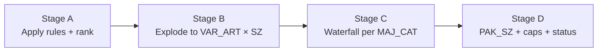

# Allocation Process

> **Goal:** turn the cap-cleared `listed_opt` rows into actual ship instructions per variant per size — that is, write `ARS_ALLOC_WORKING` then promote to `alloc_header` / `alloc_detail`.

---

## The four stages inside the engine



| Stage | File / function | What it does |
|---|---|---|
| **A** | `rule_engine_pandas.py:516-537` `_stage_a_*` | Adds per-OPT calc columns; assigns `OPT_PRIORITY_TIER` + `OPT_PRIORITY_RANK`; writes `ARS_LISTED_OPT`. |
| **B** | `rule_engine_pandas.py:544-556` `_stage_b_explode` | Joins LISTED × `ARS_MSA_VAR_ART` → `ARS_ALLOC_WORKING` at (WERKS × OPT × VAR_ART × SZ) grain. Fills `CONT`, `SZ_MBQ`, `SZ_REQ`, `FNL_Q`. |
| **C** | `rule_engine_pandas.py:1292-1426` `_run_majcat_waterfall` | Per MAJ_CAT in parallel subprocesses (default 4 workers). Drain the pool RL → TBC → TBL, round by round. |
| **D** | `rule_engine_pandas.py:832-1003` | PAK_SZ rounding → `MJ_REQ` gate → 130% sec-cap → recompute `FNL_Q_REM` → set `ALLOC_STATUS` and `SKIP_REASON`. |

---

## Stage C — the waterfall

The most important loop in the system:

```python
for ot in [RL, TBC, TBL]:
  for r in 1 .. max(I_ROD):                # I_ROD = rounds per OPT
    mbq_budget = _live_mbq_budget(working_df, cap_pct_for_ot)
    _run_band(...)                          # all stores compete this round
    _revalidate_after_band(...)             # decrement remaining, recompute caps
```

What "round" means in plain English: each OPT has an `I_ROD` (Inventory Replenishment Over Days). Round 1 fills `1× SZ_MBQ` worth of need, round 2 fills `2× SZ_MBQ`, … up to `r × SZ_MBQ`. So a high-velocity store with `I_ROD=2` ships across 2 rounds.

Inside `_run_band`:
1. Sort by `OPT_PRIORITY_RANK → ST_RANK → WERKS`. Top-priority OPT in top-rank store gets first dibs.
2. For each row, compute `need_ship = r × SZ_MBQ − SZ_STK − SHIP_QTY_already_shipped`.
3. `take_pool = min(pool[VAR_ART, SZ], need_ship, mbq_budget[WERKS])`.
4. `SHIP_QTY += take_pool`; `pool -= take_pool`; `mbq_budget -= take_pool`.
5. Append trace token to `ALLOC_REMARKS` (e.g. `B[RL.r1.rk1] sh=5 hld=0 pool=120->115;`).

`_revalidate_after_band` then:
- Decrements `MSA_FNL_Q_REM`.
- Decrements every primary-grid `*_REQ_REM`.
- Recomputes `H_*_REM` and `PRI_CT_REM`.
- Re-marks SKIP for next rounds (store-broken + primary-broken).

---

## Stage D — finalisation

In order:

1. **`_stage_d_apply_pak_sz_rounding`** — round `SHIP_QTY` to nearest multiple of `PAK_SZ` (carton size). A row that rounds to less than half a pack is zeroed with `SKIP_REASON = PAK_SZ_BELOW_HALF`.
2. **`_stage_c_apply_opt_mj_req_gate`** — per OPT_TYPE post-cap: `SUM(SHIP_QTY) ≤ cap_pct × MJ_REQ`. Trim if breach.
3. **Recompute `FNL_Q_REM`** from final `SHIP_QTY` (so reviewers see the real pool state).
4. **`ALLOC_QTY = SHIP_QTY`** — the dispatch column.
5. **`ALLOC_STATUS`** classifier:
   - `ALLOCATED` — shipped ≥ target (`r × SZ_MBQ − SZ_STK`).
   - `PARTIAL` — shipped > 0 but below target.
   - `SKIPPED` — `SHIP_QTY = 0` with a SKIP_REASON.
   - `INELIGIBLE` — never qualified for the waterfall.
   - `PENDING` — held for a later run.
6. **`_classify_alloc_reason`** — fill `SKIP_REASON` from a known set.
7. **If `apply_sec_cap_in_normal = true`** → `_apply_sec_grid_cap_pre_gate` (130% rule per Secondary grid).
8. **`_stage_d_reflect`** — push totals back to `ARS_LISTING_WORKING`.

---

## SKIP_REASON catalogue

| Reason | Meaning |
|---|---|
| `NO_POOL_MSA`              | Pool was 0 — MSA had no available stock for this VAR. |
| `NO_REQ`                   | `SZ_REQ = 0` — store already has enough. |
| `ALREADY_STOCKED`          | `STK_TTL ≥ SZ_MBQ` — shelf is at target. |
| `MJ_REQ_GATE_FAIL`         | Stage D cap trimmed this row to 0. |
| `SEC_CAP_<grid>`           | 130% Secondary cap trimmed this row (e.g. `SEC_CAP_MJ_FAB`). |
| `PAK_SZ_BELOW_HALF`        | Rounded ship qty was less than half a pack. |
| `SKIP_PRI_BROKEN(pri=...)` | Primary-grid coverage too low. |
| `SKIP_STORE_BROKEN(mj_rem=...)` | `MJ_REQ_REM < 0.5 × ACS_D`. |
| `SKIP_MSA_EXHAUSTED`       | Pool drained during waterfall. |
| `R07_SIZE_RATIO_LIVE`      | TBL size-ratio rule — too few sizes available. |

---

## The two output tables

### `ARS_ALLOC_WORKING` — calc table

Wide working table the engine writes during the run. Key columns (full list in Variables Glossary):

```
WERKS, RDC, MAJ_CAT, GEN_ART, CLR, VAR_ART, SZ, OPT_TYPE,
OPT_PRIORITY_RANK, ST_RANK, I_ROD,
CONT, SZ_MBQ, SZ_STK, SZ_REQ, FNL_Q, FNL_Q_REM,
SHIP_QTY, HOLD_QTY, ALLOC_QTY, ALLOC_STATUS, SKIP_REASON,
ALLOC_WAVE, ALLOC_ROUND, ALLOC_REMARKS, ALLOC_BATCH_ID, PAK_SZ
```

### `alloc_header` / `alloc_detail` — OLTP approval tables

After approval, the engine output is promoted to relational tables for the operator workflow (`backend/app/models/retail.py:131-172`).

**`alloc_header`** — one row per session:

| Column | Purpose |
|---|---|
| `id`, `allocation_code` (unique) | Identity |
| `allocation_type` | INITIAL / REPLENISHMENT / TRANSFER |
| `season`, `division_id` | Tags |
| `status` | DRAFT → IN_PROGRESS → APPROVED → EXECUTED / CANCELLED |
| `total_qty`, `total_stores`, `total_options` | Roll-ups |
| `created_by`, `approved_by`, `executed_at` | Audit |

**`alloc_detail`** — one row per (store × variant × size):

| Column | Purpose |
|---|---|
| `allocation_id` (FK) | Links to header |
| `store_code`, `gen_article_id`, `variant_id`, `size_code`, `color_code` | Where it goes |
| `allocated_qty` | Engine output |
| `override_qty` | Operator manual override |
| `final_qty` | = `override_qty` if set, else `allocated_qty` |
| `store_grade`, `allocation_basis` | Tags |

---

## Pool / pending interaction

`FNL_Q` comes from `ARS_MSA_VAR_ART`:

```
FNL_Q = max(STK_QTY − PEND_QTY, 0)
```

That means **pending allocations are netted out upstream** in the MSA build. The rule engine never sees `PEND_QTY` directly; it only sees the safe pool.

Why this matters: if you upload stale `PEND_QTY` data, the engine will over-allocate by exactly that amount. **Always refresh `MASTER_ALC_PEND` before the run.**

---

## Parallelism + writer queue

```
ProcessPoolExecutor(max_workers=4)
  └─ _run_majcat_waterfall(MAJ_CAT_001)  ──┐
  └─ _run_majcat_waterfall(MAJ_CAT_002)  ──┤
  └─ _run_majcat_waterfall(MAJ_CAT_003)  ──┼──> writer_queue (single thread)
  └─ ...                                  ──┘     ↓
                                                ARS_ALLOC_WORKING
```

| Knob | Default | Effect |
|---|---|---|
| `parallel_workers`  | UI `4`, max 8         | More = faster, but past 8 GIL/tempdb contention dominates. |
| `use_writer_queue`  | `true`                | Single dedicated DB writer thread → zero writer-writer deadlocks. |
| `allocation_mode`   | `pandas` (production) | `sequential` is the reference / debug path. |

---

## Read next

- **[Pending Allocation](/process/pending-alc)** — what happens *after* alloc_detail is written.
- **[Variables Glossary](/process/variables)** — every column above defined.
