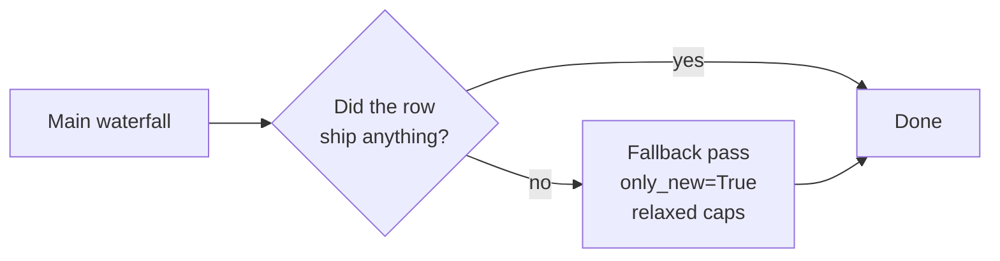

# Fallback Process — Archived

> **Fallback was removed on 2026-05-16.** This page exists to (a) explain what it used to do, and (b) tell you what to do instead today.

Source of truth: `backend/app/docs/processes/fallback_archived.md`, plus the in-code note `listing_allocator.py:68` — *"Fallback support was stripped 2026-05-16."*

---

## What "fallback" used to be

The legacy two-pass design:

**The idea:** any OPT with `ALLOC_QTY = 0` and unspent pool got a second chance with a more relaxed cap configuration. Fallback growth was applied at the same MJ + grid level as the main pass.

**Why it was removed:**

| Problem | Effect |
|---|---|
| Operators couldn't predict what fallback would ship | Allocation totals jumped between runs even with the same inputs |
| Two code paths to maintain | Bugs leaked between main + fallback |
| Sec-cap interaction was unclear | Sometimes fallback breached 130% Secondary cap silently |
| Hard to audit *why* a row shipped | `SKIP_REASON` blank, `ALLOC_REMARKS` confused |

The decision was: one transparent pass, every skip explained.

---

## What happens now (today's behaviour)

A row that the **main waterfall** could not ship stays **`SKIPPED`** with its real `SKIP_REASON`. There is no automatic second chance.

The closest UI knob still alive: **`apply_sec_cap_in_normal`** (default `true`):

| `apply_sec_cap_in_normal` | Effect |
|---|---|
| **true (default)** | 130% Secondary cap fires *inside* the main pass. The behaviour you want in production. |
| **false** | Secondary caps not enforced — bigger ships, but you can breach a Secondary grid by a lot. Debugging only. |

---

## "But the row should have shipped!" — operator recipe

The fallback is now **manual** and operator-driven. When you see a row you expected to ship but it's `SKIPPED`:

### Step 1 — Read the `SKIP_REASON`

In the Alloc Review page, every row carries its reason. Look at it first.

| If you see… | Then… |
|---|---|
| `NO_POOL_MSA`              | Pool was empty. The RDC has no stock. Look upstream (warehouse / inbound). |
| `NO_REQ` / `ALREADY_STOCKED` | Store already has enough. Nothing to do. |
| `MJ_REQ_GATE_FAIL`         | The post-waterfall cap trimmed this row. Raise `*_mj_req_cap_pct` if you want headroom. |
| `SEC_CAP_<grid>`           | Secondary 130% trim. Either raise the grid's MBQ or accept the cap. |
| `PAK_SZ_BELOW_HALF`        | Rounded to <0.5 pack. Adjust PAK_SZ or accept. |
| `SKIP_PRI_BROKEN(pri=...)` | Primary-grid coverage too low. Turn **off** `pri_ct_check_rl/tbc` to relax. |
| `SKIP_STORE_BROKEN(mj_rem=…)` | `MJ_REQ_REM < 0.5 × ACS_D`. Earlier OPT_TYPE ate the budget. Raise `mj_req_growth_pct` or adjust priorities. |
| `SKIP_MSA_EXHAUSTED`       | Pool drained mid-waterfall. Same as `NO_POOL_MSA`. |
| `R07_SIZE_RATIO_LIVE`      | TBL size-ratio rule. Too few sizes in pool. |

### Step 2 — Pick the correct knob, change ONE thing

Don't change three knobs at once. Find the single setting that addresses the reason:

| Goal | Knob | Direction |
|---|---|---|
| More RL headroom | `mj_req_growth_pct` | raise to 110–130 |
| Relax PRI gate | `pri_ct_check_rl` / `pri_ct_check_tbc` | switch off |
| Allow over-ship vs plan | `rl_mj_req_cap_pct` etc. | raise to >100 |
| Relax Secondary cap | `apply_sec_cap_in_normal` | off (debug only) |
| Strict-to-plan | `mj_req_growth_pct = 100` | (default) |

### Step 3 — Re-run

The rerun is just another listing pass with new payload values. Diff the parked snapshots to see what moved.

> The session-wise archive in **Alloc Review** is your friend here — every parked run is preserved with its full input + output.

---

## Why this is better than the old fallback

| Old (with fallback) | Today |
|---|---|
| Two passes, both could ship | One pass, one transparent decision |
| Hard to explain why row X shipped 12 instead of 0 | Every row has a `SKIP_REASON` or `ALLOC_STATUS` |
| Knob behaviour different in fallback | Same knob, same effect, every time |
| Fallback growth at MJ × grid (yes) but timing weird | Growth applied once, at the right grain |

---

## Read next

- **[Allocation Process](/process/allocation)** — the single pass that replaces fallback.
- **[Variables Glossary](/process/variables)** — every knob you can change to recover a skipped row.
