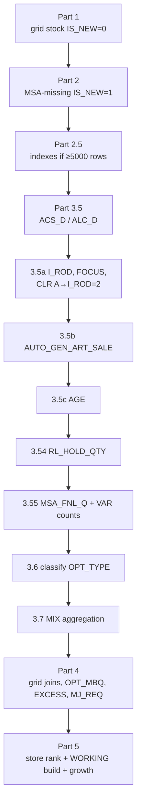

# Listing Build — Parts 1 → 5 (`_generate_listing_impl`)

> **Where we are:** this is the very first thing that runs when you click **Generate**. It builds `ARS_LISTING` (every store × option), enriches it with density/sales/age, classifies each option RL/TBC/TBL/MIX, computes OPT-level MBQ, then writes `ARS_LISTING_WORKING` for Stage A.

**Code:** `backend/app/api/v1/endpoints/listing.py`, `_generate_listing_impl` (line 506), parts spanning lines ~700–2042.

**Carried worked example** (a real `ARS_LISTING` row from local HOPC560):

| Field | Value |
|---|---|
| WERKS (store) | `HY01` |
| RDC | `DH24` |
| MAJ_CAT | `LS_BABY_WIPES` |
| GEN_ART_NUMBER | `1240054061` |
| CLR | `A` |

We follow this row part-by-part. Final DB values: `STK_TTL=31`, `ACS_D=12`, `ALC_D=12`, `AUTO_GEN_ART_SALE=0.025`, `AGE=147`, `I_ROD=2`, `MSA_FNL_Q=1`, `OPT_MBQ=12`, `OPT_REQ=0`, `MJ_MBQ=175`, `MJ_REQ=0`, `OPT_TYPE='RL'`.



---

## Part 1 — Grid stock (existing) → `IS_NEW=0`

**Layman:** one listing row per option that already has grid stock. SLOC columns are summed into `STK_TTL`, negatives clamped to 0.

```sql
STK_TTL = CASE WHEN (Σ stock SLOC cols) < 0 THEN 0 ELSE (Σ ...) END   -- line 785
```

**Example:** our row gets `STK_TTL=31`, `IS_NEW=0`, `OPT_TYPE=NULL`.

> **Change notes:** the negative→0 clamp is load-bearing — removing it lets SLOC adjustment negatives inflate downstream `OPT_REQ`. `GEN_ART_NUMBER` is `TRY_CAST(... AS BIGINT)` — alphanumeric article codes silently become NULL and never join MSA.

---

## Part 2 — MSA-missing options → `IS_NEW=1`

**Layman:** add rows for MSA-recommended options that have **no** existing stock (brand-new listings), with zero stock. Guarded by `NOT EXISTS` so Part-1 rows aren't duplicated.

In `all` mode the MSA→store join is `ON 1=1` — **every MSA option lands in every active store**. This is the row-count explosion driver; scope with filters before touching.

**Example:** our row already exists from Part 1, so `NOT EXISTS` skips it.

> **Change note:** the `NOT EXISTS` matches on the 4-tuple with no re-normalisation on the existing side — if MSA `CLR` has trailing spaces and Part 1's doesn't, you get **duplicate rows**. Both sides currently normalise; keep them mirrored.

---

## Part 2.5 — Indexes (only if ≥ 5000 rows)

Creates 3 nonclustered indexes on `ARS_LISTING` so the enrichment joins seek. The critical one is `IX_..._OPTKEY (WERKS,MAJ_CAT,GEN_ART_NUMBER,CLR)`.

> **Change note:** the `5000` threshold is a hardcoded magic number — candidate to promote to a setting if you tune small-batch latency.

---

## Part 3.5 / 3.5a — ACS_D, ALC_D, I_ROD, FOCUS flags

**Layman:** pull display density (`ACS_D`) and allocation-days (`ALC_D`) from `ARS_CALC_ST_MAJ_CAT`; then finer per-OPT values (`LISTING`, `I_ROD`, `FOCUS_W_CAP`, `FOCUS_WO_CAP`) from `ARS_CALC_ST_ART`; then a hardcoded override:

```sql
UPDATE ARS_LISTING SET I_ROD = 2 WHERE UPPER(TRIM(CLR)) IN ('A','A_MIX')   -- line 980
```

**Example:** `ACS_D=12`, `ALC_D=12`; CLR=`A` so `I_ROD=2` (override). Matches DB.

> **Change notes:**
> - `ACS_D` is **accessories density (one display qty), NOT daily sale** — velocity is `MAX_DAILY_SALE` (Part 4c). Don't confuse them.
> - The `'A'`/`'A_MIX'` → `I_ROD=2` rule is a hardcoded business rule; a new accessory CLR sentinel won't be caught. Consider sourcing the list from config.
> - `INNER JOIN` on `ARS_CALC_ST_MAJ_CAT` means stores with no density row keep `ACS_D=NULL` → fall back to `default_acs_d` later. No warning is logged — consider a LEFT-join diagnostic.

---

## Part 3.5b / 3.5c — AUTO_GEN_ART_SALE & AGE

**Layman:** `AUTO_GEN_ART_SALE` = planned per-day sale (`SAL_PD`); `AGE` = option age in days. Both at full OPT grain.

**Example:** `AUTO_GEN_ART_SALE=0.025`, `AGE=147`. Since `147 ≥ age_threshold(15)`, this OPT uses the **aged** rate in Part 4c.

> **Change notes:**
> - A **missing `MASTER_GEN_ART_AGE`** isn't a silent no-op: `AGE=NULL → treated as 0 < threshold → everything treated as new`, which inflates OPT_MBQ for the whole run. Consider a hard gate if AGE is required.
> - There's a **duplicate warning log** at lines 1009-1010 (copy-paste) — safe cleanup.
> - CLR normalisation must match between `ARS_LISTING` and `MASTER_GEN_ART_SALE` or `SAL_PD` drops silently → smaller OPT_MBQ.

---

## Part 3.54 — RL_HOLD_QTY (open warehouse holds)

**Layman:** roll up still-open NL warehouse holds (`HOLD_REM` where `IS_CLOSED=0`) to the OPT grain. Classification treats `RL_HOLD_QTY > 0` as "supply exists" even if store stock is 0.

**Example:** `RL_HOLD_QTY=0` (no open hold for this RL option).

> **Change note:** the block is `try/except → warning`. A failure leaves `RL_HOLD_QTY=0` and the run continues — but TBL re-listings then lose hold context and may reclassify to MIX. `RL_HOLD_QTY` (prior-run hold) is distinct from `HOLD_QTY` (current-run Stage C hold) — do not merge.

---

## Part 3.55 — MSA_FNL_Q + VAR_COUNT / VAR_FNL_COUNT

**Layman:** per-OPT MSA pool (`SUM(FNL_Q)`) plus size-coverage counts, both needed by classification.

**Example:** `MSA_FNL_Q=1`, `VAR_COUNT=1`, `VAR_FNL_COUNT=1` → coverage 100%, supply exists.

> **Change note:** a VAR-count failure leaves NULLs → MIX(b) poor-fill detection silently disables (its guard is `VAR_COUNT>0`). Real behaviour change on failure; worth a louder signal.

---

## Part 3.6 — OPT_TYPE classification (4-way)

**Layman:** assign each option exactly one of MIX / RL / TBC / TBL via a top-down CASE (first match wins). `threshold = stock_threshold_pct` (0.6), `default_acs = default_acs_d` (18).

```sql
SET OPT_TYPE = CASE
  WHEN STK_TTL < threshold*ACS_D AND MSA_FNL_Q=0 AND RL_HOLD_QTY=0       THEN 'MIX'   -- (a) nothing to send
  WHEN VAR_COUNT>0 AND (VAR_FNL_COUNT/VAR_COUNT < threshold
       [OR VAR_FNL_COUNT < min_size_count])                              THEN 'MIX'   -- (b) poor fill
  WHEN (STK_TTL >= threshold*ACS_D OR RL_HOLD_QTY>0) AND MSA_FNL_Q>0     THEN 'RL'
  WHEN STK_TTL>0 AND STK_TTL < threshold*ACS_D
       AND (MSA_FNL_Q>0 OR RL_HOLD_QTY>0)                                THEN 'TBC'
  WHEN STK_TTL<=0 AND (MSA_FNL_Q>0 OR RL_HOLD_QTY>0)                     THEN 'TBL'
  ELSE 'MIX' END
```

**Example:** `threshold×ACS_D = 0.6×12 = 7.2`. `STK_TTL=31 ≥ 7.2` AND `MSA_FNL_Q=1 > 0` → **RL**. (This only works because the run used `min_size_count=0`; see escalation.)

> **🔴 Escalation finding:** with the default `min_size_count=3`, a 1-size accessory like CLR='A' baby wipes (`VAR_COUNT=1`) is forced to **MIX** by branch (b) — `1 < 3` — and never reaches RL. The live DB row is `RL`, meaning that run used `min_size_count=0`. **The size gate misclassifies legitimately single-size accessory options as MIX.** Recommend exempting accessory CLRs (`A`/`A_MIX`) from the MIX(b) size clause.

> **Change note:** Order is load-bearing (MIX(a) → MIX(b) → RL → TBC → TBL → else). The `else 'MIX'` catch-all means no row stays untagged — the `untagged` counter is effectively dead telemetry.

---

## Part 3.7 — MIX aggregation

**Layman:** collapse all `MIX` rows into **one** line per (WERKS, MAJ_CAT) with `GEN_ART_NUMBER=0`, `CLR='MIX'`. `mix_mode='each'` skips this.

> **🔴 Dead knob:** despite `mix_mode` accepting `st_maj_rng` vs `st_maj`, the GROUP BY is hardcoded to `(WERKS, MAJ_CAT)` and the RNG column is always `NULL`. So `st_maj_rng` and `st_maj` produce **identical** output — the RNG-segmented MIX path is unimplemented. Either implement it or remove the distinction.

---

## Part 4 — Grid joins, OPT_MBQ, EXCESS, MJ_REQ

The biggest part. Sub-steps:

### 4 pre-resolve — MP attributes onto listing (sec-cap propagation point)

Populates `FAB`, `MACRO_MVGR`, `MICRO_MVGR`, `M_VND_CD`, `RNG_SEG` from `vw_master_product`.

> **⚠ Sec-cap invariant:** this is exactly where the grid-extra columns are seeded. They're carried via `_FINAL_KEEP_COLS` (line 59) into the working table and must reach alloc. **Removing a column from `mp_needed_cols` or `_FINAL_KEEP_COLS` silently drops sec-cap grids.** Don't prune.

### 4a — grid column joins (origin of MJ_MBQ / MJ_STK_TTL)

For each active grid, copies `{prefix}_MBQ`, `{prefix}_STK_TTL`, `{prefix}_DISP_Q` etc. The MJ grid (hierarchy `[WERKS, MAJ_CAT]`) yields prefix `MJ` → this is where `MJ_MBQ=175`, `MJ_STK_TTL`, `MJ_DISP_Q` come from.

### 4c — OPT_MBQ / OPT_REQ / OPT_MBQ_WH / MAX_DAILY_SALE

```sql
eff_age  = CASE WHEN STK_TTL<=0 AND L-7_sale<=0 THEN 0 ELSE AGE END
rate     = CASE WHEN eff_age < age_threshold
                THEN MAX(PER_OPT_SALE, l7_daily, AUTO_GEN_ART_SALE)   -- new article
                ELSE MAX(l7_daily, AUTO_GEN_ART_SALE) END             -- aged
OPT_MBQ    = ROUND(ACS_D + rate × ALC_D, 0)
OPT_REQ    = MAX(0, ROUND(OPT_MBQ − STK_TTL))
OPT_MBQ_WH = ROUND(ACS_D + rate × (ALC_D + CASE WHEN OPT_TYPE='TBL' THEN hold_days ELSE 0 END), 0)
MAX_DAILY_SALE = ROUND(rate-like expr, 3)
```

**Example** (AGE=147 → aged; rate ≈ AUTO 0.025):
- `OPT_MBQ = ROUND(12 + 0.025×12) = ROUND(12.3) = 12` ✓
- `OPT_REQ = MAX(0, 12 − 31) = 0` ✓
- `OPT_MBQ_WH = 12` (RL, hold adds 0) ✓
- `MAX_DAILY_SALE = 0.025` ✓

> **Change note:** `hold_days` applies **only** to `OPT_TYPE='TBL'` (line 1704). For low-velocity accessories, `OPT_MBQ ≈ ACS_D` because tiny rates round away.

### 4d — ART_EXCESS / EXCESS_STK

```sql
eff_mult   = MAX(I_ROD, excess_multiplier)
ART_EXCESS = CASE WHEN OPT_TYPE='MIX' THEN 0
                  WHEN STK_TTL − eff_mult×OPT_MBQ > 0 THEN ROUND(STK_TTL − eff_mult×OPT_MBQ) ELSE 0 END
```

**Example:** `eff_mult = MAX(2, 2) = 2`; `31 − 2×12 = 7 > 0` → `ART_EXCESS = 7`, `EXCESS_STK = 7`.

> **Change note:** `I_ROD=2` forced for CLR='A' (Part 3.5a) interacts here — accessory displays automatically get a 2× excess floor regardless of `excess_multiplier`. Intended but non-obvious.

### 4e — per-grid REQ with excess deduction (origin of MJ_REQ)

For each grid, aggregate `ART_EXCESS` by the grid's hierarchy, deduct from `{prefix}_STK_TTL` (clamp 0), then `{prefix}_REQ = MAX(0, {prefix}_MBQ − deducted_stk)`. **This creates `MJ_REQ`.**

**Example:** our row `MJ_REQ=0` ⇒ deducted MJ_STK_TTL ≥ MJ_MBQ(175).

> **Change notes:**
> - **Growth-at-MJ-grid invariant:** MJ_REQ/MJ_MBQ are at MAJ_CAT+grid level, never per OPT_TYPE. ✅
> - **MBQ sparseness:** `ISNULL({prefix}_MBQ,0)` → REQ→0 when a grid is silent ("no constraint"). Don't invent a synthetic MBQ.
> - Deduction is idempotent only because Part 4a rewrites `{prefix}_STK_TTL` fresh each rebuild. If you stop rewriting it, deduction compounds across runs.

---

## Part 5 — Store ranking + WORKING build + growth gate

(Header line 1862 says "PART 5: All moved earlier" — MJ_* come from Part 4.)

### Store ranking → ST_RANK (lines 1873-1937)

Covered in detail in [Stage A](/process/stage-a-rank#a-aux---st_rank-computed-upstream-not-in-stage-a). Weighted blend of requirement-rank and fill-rank using `req_weight` (0.4) / `fill_weight` (0.6). Excludes MIX rows.

### ARS_LISTING_WORKING build + growth gate (lines 1939-2042)

**Eligibility WHERE** — a row only flows to allocation if all hold:
- `(MSA_FNL_Q>0 OR RL_HOLD_QTY>0)`
- `OPT_REQ_WH >= 1`
- TBL size gate: `OPT_TYPE != 'TBL' OR VAR_COUNT=0 OR ratio >= threshold [OR VAR_FNL_COUNT >= min_size_count]`
- `LISTING = 1`
- `MJ_DISP_Q > 0`

**Growth gate (2026-06 update — multi-grid lift):**

Growth now lifts **every active non-pivot grid's MBQ**, not just MJ. The multiplier always reads `*_MBQ_ORIG` (idempotent — re-runs never compound), and the lifted value is promoted into the live `*_MBQ` / `*_REQ` columns when `growth ≠ 100`.

```sql
-- For each grid in ARS_GRID_BUILDER where status='Active' AND pivot_only=0
-- (and always MJ), per prefix in {MJ, FAB, MICRO_MVGR, MACRO_MVGR, M_VND_CD, RNG_SEG, ...}:

-- 1. One-time snapshot (first run wins):
UPDATE [{prefix}_MBQ_ORIG] = [{prefix}_MBQ] WHERE [{prefix}_MBQ_ORIG] IS NULL
UPDATE [{prefix}_REQ_ORIG] = [{prefix}_REQ] WHERE [{prefix}_REQ_ORIG] IS NULL

-- 2. Lift (always reads ORIG → idempotent):
[{prefix}_MBQ_REV] = ROUND([{prefix}_MBQ_ORIG] × growth_pct/100, 0)
[{prefix}_REQ_REV] = MAX(0, ROUND([{prefix}_MBQ_REV] − [{prefix}_STK_TTL]))

-- 3. Promote into live columns (only when growth ≠ 100):
if growth_pct != 100:
    UPDATE [{prefix}_MBQ] = [{prefix}_MBQ_REV]
    UPDATE [{prefix}_REQ] = [{prefix}_REQ_REV]
```

**Example:** Setting growth = 110% with active grids `MJ, MJ_FAB, MJ_MICRO_MVGR, MJ_RNG_SEG` lifts all four — MJ_MBQ from 100 → 110, FAB_MBQ from 40 → 44, MICRO_MVGR_MBQ from 20 → 22, RNG_SEG_MBQ from 35 → 39.  The +10% cushion now flows through every sub-budget instead of being throttled at the first secondary cap.

> **Change notes:**
> - **All non-pivot grids lift together** (2026-06): each grid's `_MBQ` / `_REQ` is now part of the growth gate.  Pivot-only grids (`pivot_only=1`) skip the lift — they don't carry a real `_MBQ` to begin with.
> - **Idempotent on ORIG:** the multiplier always reads `*_MBQ_ORIG`.  Re-running the same session with growth=110 a second time produces the same lifted `*_MBQ`, never 110% of 110% = 121%.
> - **Grain stays per-MAJ_CAT:** each grid's hierarchy carries `WERKS, MAJ_CAT` (+ extras like FAB/MICRO_MVGR), so the lift partitions naturally by MAJ_CAT — no per-category UI needed.
> - **Per-OPT_TYPE caps read ORIG** (Decision 4-B): RL/TBC/TBL `*_mbq_cap_pct` formulas use `MJ_MBQ_ORIG`.  When PRI ≥ 100% is ON for an OPT_TYPE, the cap follows `mj_req_growth_pct` (default).  When PRI is OFF, an inline "Dispatch Cap %" slider appears next to the toggle and the user-set value becomes the cap.  TBL has no PRI toggle and always tracks growth.
> - **Sec-cap auto-widens** (Decision 2): the secondary-grid cap factor becomes `max(SEC_CAP_DEFAULT_PCT, growth_pct)`, replacing the 130% baseline when growth is larger.
> - **MJ Primary participates in sec-cap** when `apply_sec_cap_in_normal=True` — the pre-gate now blocks OPTs that would push the MAJ_CAT total above `effective_cap_pct × MJ_MBQ_ORIG`.

---

## Change / upgrade summary for the listing build

| # | Finding | Severity |
|---|---|---|
| 1 | `min_size_count=3` misclassifies single-size accessories as MIX | 🔴 escalate |
| 2 | `mix_mode` st_maj_rng vs st_maj produce identical output (RNG path unimplemented) | 🔴 dead knob |
| 3 | Missing `MASTER_GEN_ART_AGE` silently treats all as new → inflates OPT_MBQ | ⚠ |
| 4 | `'A'/'A_MIX'`→I_ROD=2 and `5000` index threshold hardcoded | ⚠ promote to config |
| 5 | Duplicate warning log (lines 1009-1010); `untagged` counter dead | cleanup |
| 6 | Many parts are `try/except → warning` — failures change behaviour, not no-ops | ⚠ |

---

**Next:** [Stage A — Rule & Rank](/process/stage-a-rank)
