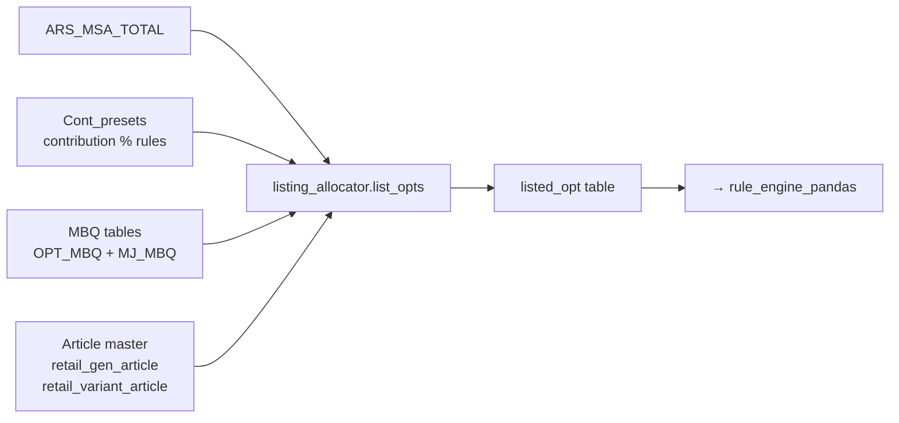

# Listing Process — Picking OPTs for each store

> **Goal of listing:** for every (WERKS = store, MAJ_CAT) decide which OPTs are eligible to receive stock this run.

> **OPT** = one (WERKS, MAJ_CAT, GEN_ART, CLR) combination. Each OPT has exactly **one** OPT_TYPE.

---

## Input → Output



---

## Step-by-step (layman)

### Step 1 — Pull the universe
For each `(WERKS, MAJ_CAT)` the system loads every GEN_ART that has either:
- stock in the RDC, OR
- an MBQ entry in the planner sheet, OR
- pending allocation already booked.

The result is a **candidate list**, not the final list.

### Step 2 — Classify each candidate as RL / TBC / TBL / MIX

Source: `listing.py:1182-1224` (`_classify_opt_type`). First match wins, top-down:

| Label | Stands for | Plain English | Condition |
|---|---|---|---|
| **MIX (a)** | catch-all                | Nothing to ship anywhere. | `STK_TTL < threshold × ACS_D` AND `MSA_FNL_Q = 0` AND `RL_HOLD_QTY = 0` |
| **MIX (b)** | thin coverage            | Too few sizes/colours to bother. | `VAR_FNL_COUNT / VAR_COUNT < threshold` (and optionally `< min_size_count`) |
| **RL**  | **Replenishment Line**     | Shelf is healthy, just top up. | `(STK_TTL ≥ threshold × ACS_D OR RL_HOLD_QTY > 0)` AND `MSA_FNL_Q > 0` |
| **TBC** | **To Be Covered**          | Shelf running low, push more. | `0 < STK_TTL < threshold × ACS_D` AND `(MSA_FNL_Q > 0 OR RL_HOLD_QTY > 0)` |
| **TBL** | **To Be Launched**         | Shelf empty, full display. | `STK_TTL ≤ 0` AND `(MSA_FNL_Q > 0 OR RL_HOLD_QTY > 0)` |
| MIX (else) | leftover                | Didn't match above. | else |

- `threshold` = `stock_threshold_pct` slider (default **0.6** = 60%)
- `ACS_D` falls back to `default_acs_d = 18` when null/zero
- `min_size_count` slider — default `3`, UI toggle `enableMinSize` defaults **off** so effective value sent = `0`

> **Mutually exclusive at OPT grain.** A single (WERKS, MAJ_CAT, GEN_ART, CLR) is exactly one OPT_TYPE. Never two at once. Priority in the waterfall: **RL first → TBC → TBL**.

### Step 3 — Apply contribution % presets
The `Cont_presets` table holds rules like *"in MAJ_CAT 070, MICRO_MVGR X should be 12% of the store's MAJ_CAT pie."* If a candidate would push a grid past its contribution ceiling, it gets dropped *here*, before the cap math.

Edit presets at **Contribution % → Presets**.

### Step 4 — Attach MP columns
For sec-cap to work later, every listed OPT must carry these columns:

| Column | What it is |
|---|---|
| `FAB`           | Fabric family (e.g., COTTON, POLY) |
| `MACRO_MVGR`    | Macro merchandise group |
| `MICRO_MVGR`    | Micro merchandise group |
| `M_VND_CD`      | Master vendor code |
| `RNG_SEG`       | MRP tier — `E` / `V` / `P` / `SP` |

> **⚠️ Critical:** if any of these drop out between listing → listed → alloc, sec-cap will *silently fail* and you'll over-allocate. The system has a propagation check; don't disable it.

### Step 5 — Write `listed_opt`
The output table has one row per qualified OPT, with:

```
WERKS, MAJ_CAT, GEN_ART, CLR, OPT_TYPE,
OPT_MBQ, MJ_MBQ, MJ_REQ,
FAB, MACRO_MVGR, MICRO_MVGR, M_VND_CD, RNG_SEG,
FNL_Q,            -- really-available stock = max(STK - PEND, 0)
MAX_DAILY_SALE,   -- velocity proxy
ACS_D             -- accessories density (NOT daily sale)
```

---

## Worked example

Suppose store **WERKS = 1234**, **MAJ_CAT = 070** (Men's Tee), single GEN_ART **G-887**, two colours **NAVY** and **WHITE**.

| OPT | OPT_TYPE | OPT_MBQ | MJ_MBQ | MJ_REQ | FNL_Q (RDC) |
|---|---|---|---|---|---|
| G-887/NAVY  | RL  | 8 | 24 | 18 | 240 |
| G-887/WHITE | RL  | 8 | 24 | 18 | 180 |
| G-887/BLACK | TBC | 6 | 24 | 18 |  60 |
| G-887/RED   | TBL | 4 | 24 | 18 |  40 |

After Step 4 the four rows go into `listed_opt`. **None are dropped at listing** because all have MBQ > 0 and stock > 0. The dropping happens later in primary cap + sec-cap.

---

## Common reasons an OPT is **not** listed

| Symptom | Likely cause | Fix |
|---|---|---|
| OPT shows in MSA but missing from listed_opt | No MBQ entry, no stock, no pending | Add MBQ row or upload stock |
| Wrong OPT_TYPE assigned | Article master flag stale | Refresh `retail_gen_article` / `retail_variant_article` |
| Contribution preset blocking | Preset percentage too tight | Edit at Contribution % → Presets |
| Whole MAJ_CAT missing | SLOC excluded by filter in Step 1 of MSA | Check Store Sloc Validation |

---

## Where to look in the UI

- **Listing & Alloc → Listing** — run listing, see the `listed_opt` output.
- **Listing & Alloc → Listing logs** — every run with payload + counts.
- **Listing & Alloc → Merge Rules** — how multi-vendor / multi-WERKS rows collapse.

> **Default mode:** the UI ships with `allocation_mode = pandas`. That means `rule_engine_pandas.py` is what really runs. Changing only `rule_engine_new.py` is a no-op in production.

---

## Read next

- **[Primary & Sec-Cap](/process/sec-cap)** — how the listed_opt rows get filtered down.
- **[Variables Glossary](/process/variables)** — full definition of every column above.
