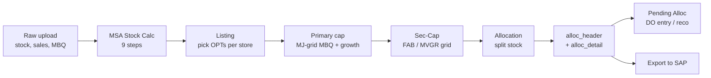

# ARS V2 — Process Overview

> **In one line:** ARS decides *what stock should go to which store* and *how many pieces of each variant*, replacing the old 20-machine Excel process used by V2 Retail across 320+ stores and 242 MAJCATs.

---

## Who is this for?

You are an operator, planner, or admin. You will:

1. **Upload** raw data (stock, sales, MBQ tables).
2. **Run Listing** — system picks which OPTs (option = SKU-cluster) qualify for each store.
3. **Run Allocation** — system splits available stock into per-store quantities.
4. **Review** — fix exceptions in *Alloc Review* / *Pending Allocation*.
5. **Export** — pass results to SAP / DO desk.

You do **not** need to be a developer. This Process section explains *every knob* in plain English and tells you what happens if you change it.

---

## The pipeline at a glance



Each box above has its own dedicated sub-page in this Process tab. Read them in order on your first day; after that, use them as reference.

---

## The 7 stages, in layman terms

### 1. Raw upload
You bring in three things:

| Input | Plain meaning | Source |
|---|---|---|
| **Stock** | How many pieces are sitting where (RDC + each store's SLOC) | SAP nightly dump |
| **Sales** | How many pieces moved out per article per day | POS feed |
| **MBQ** | The minimum/target each store grid should hold | Planner spreadsheet |

If the data is wrong here, *everything downstream is wrong*. That's why we have **Data Checklist** under **Data Validation**.

### 2. MSA Stock Calculation (9 steps)
MSA = *Master Stock Allocation*. The job: turn the raw stock dump into 3 clean tables.

The 9 steps are baked into `msa_service.py`:

1. **Filter SLOC** — drop slocs that aren't valid retail storage.
2. **Normalize** — fix column names and dtypes.
3. **Fill dimensions** — make sure every row has WERKS / MAJ_CAT / GEN_ART.
4. **Segment** — split into `SEG = [APP, GM]` (apparel vs general merch).
5. **Pivot by SLOC** — get a wide table, one column per storage location.
6. **Merge MASTER_ALC_PEND** — subtract anything already promised.
7. **Compute FNL_Q** — `FNL_Q = max(STK − PEND, 0)`. *This is the "really available" pile.*
8. **Generate color variants** — explode generic articles into colour-level rows.
9. **Aggregate** — write three output tables:
   - `ARS_MSA_TOTAL`
   - `ARS_MSA_GEN_ART`
   - `ARS_MSA_VAR_ART`

> **`ST_CD` was renamed to `RDC`** in all MSA output (April 2026). If you see `ST_CD` in old screenshots, it's the same column.

### 3. Listing
For every store × MAJ_CAT, decide *which OPTs are eligible to receive stock today*.

Key rule from the engine:

> **One OPT = one OPT_TYPE per (WERKS, MAJ_CAT, GEN_ART, CLR).**
> RL, TBC, TBL are **mutually exclusive** at the OPT grain.

Four OPT types (see `listing.py:1182-1224`):

| OPT_TYPE | What it stands for | Condition (layman) |
|---|---|---|
| **RL**  | **Replenishment Line**    | Shelf is healthy (`STK_TTL ≥ 60% × ACS_D`) and warehouse has stock → just top up. |
| **TBC** | **To Be Covered**          | Shelf is running low (`0 < STK_TTL < 60% × ACS_D`) and pool has stock → push more. |
| **TBL** | **To Be Launched**         | Shelf is empty (`STK_TTL ≤ 0`) and pool has stock → send a full display. |
| **MIX** | catch-all                  | Nothing to ship — no stock, no warehouse, no hold; or color/size availability too thin. |

> RL ships first, then TBC, then TBL — see *Sequential gate* below.

The Listing stage writes a *listed-OPT* table that the Allocation stage consumes. See **Listing Process** for the full step-by-step.

### 4. Primary cap (MJ-grid)
Even if an OPT is listed, we cap how many pieces it can take. The cap lives at the **MJ × grid** level (MJ_RNG_SEG is the primary grid; MJ_FAB / MJ_MICRO_MVGR are secondary).

The UI knobs that drive the cap (see `ListingPage.jsx` + `listing.py:_SETTING_DEFAULTS`):

| Knob | Default | Meaning |
|---|---|---|
| `mj_req_growth_pct` | **100%** *(toggle "use default 100%" is ON)* | Growth headroom on `MJ_MBQ`. Setting `110` allows 10% over plan. **The orchestrator passes this value to all three `*_mbq_cap_pct` parameters** — it is the single live knob. |
| `rl_mj_req_cap_pct`  | **100%** | Post-waterfall hard ceiling: RL `SUM(SHIP_QTY)` ≤ `cap% × MJ_REQ` per (WERKS, MAJ_CAT). |
| `tbc_mj_req_cap_pct` | **100%** | Same for TBC. |
| `tbl_mj_req_cap_pct` | **100%** | Same for TBL. |
| `pri_ct_check_rl`  | **off** | When **on**, RL must have full primary-grid coverage (`PRI_CT% ≥ 100`) — strict gate. |
| `pri_ct_check_tbc` | **off** | Same for TBC. TBL **always** enforces this check. |

> **Heads-up — known discrepancy:** the UI also shows `rl_mbq_cap_pct` and `tbc_mbq_cap_pct` sliders (default 110), but the payload sent to the engine **does not include them** — the orchestrator overrides all three to `mj_req_growth_pct`. See [Variables Glossary](/process/variables) for the file + line numbers.

A second gate runs *sequentially* RL → TBC → TBL inside each (WERKS, MAJ_CAT):

- `MJ_REQ_REM` starts at `MJ_REQ = MJ_MBQ − MJ_STK_TTL`.
- Each shipping OPT consumes its ship qty from `MJ_REQ_REM`.
- An OPT is **skipped** when `MJ_REQ_REM < 0.5 × ACS_D` (constant `ACS_SKIP_FACTOR = 0.5`).
- Multiple OPTs can ship in the same cycle.

### 5. Secondary cap (sec-cap)
On top of the primary cap, secondary grids (FAB, MACRO_MVGR, MICRO_MVGR, M_VND_CD, RNG_SEG) get their own MBQ ceilings.

> **Sparse-MBQ rule:** In sec-cap math, `*_MBQ_ORIG = 0` means **no constraint at this grain** — it does **not** mean zero budget. Never apply a breach when ORIG = 0.

**Effective cap (2026-06):** `max(SEC_CAP_DEFAULT_PCT=130, mj_req_growth_pct)` × `*_MBQ_ORIG`.

- Growth ≤ 130 → cap stays 130% (default behaviour).
- Growth = 150 → cap lifts to 150%; sec-cap and growth do **not** stack.
- The budget anchor is `*_MBQ_ORIG` (the pre-growth snapshot), so growth is applied exactly once.

**Sec-cap toggle covers MJ too (2026-06):** when `apply_sec_cap_in_normal = True`, the MJ Primary grid is gated alongside Secondary grids — the pre-gate blocks any OPT that would push the MAJ_CAT total above `effective_cap_pct × MJ_MBQ_ORIG`.

**Blocked OPTs get a self-documenting remark:**
```
SKIP_REASON   = SEC_CAP_PRE_MJ_FAB(cap=130%)
ALLOC_REMARKS = SEC_CAP_PRE_BLOCK(why="OPT would push grid MJ_FAB over its sec-cap ceiling",
                                  grid=MJ_FAB, cap=130%, before_ship=110, opt_ship=30,
                                  would_total=140, budget=130, exceeded_by=10, no_override=true);
```

> **Important:** the MP columns (FAB / MACRO_MVGR / MICRO_MVGR / M_VND_CD / RNG_SEG) must flow `listing → listed → alloc`. If they drop out, sec-cap silently fails and over-allocates.

### 6. Allocation
Now we have:
- A list of qualified OPTs per (WERKS, MAJ_CAT).
- A primary cap and a sec-cap.
- An available stock pile (FNL_Q).

Allocation walks each (WERKS, MAJ_CAT, OPT) and writes two tables:

- `alloc_header` — one row per store × MAJ_CAT × run, totals & status.
- `alloc_detail` — one row per piece variant, with from-RDC / to-WERKS / quantity.

### 7. Pending Allocation
A row stays "pending" until the store physically receives it (DO posted). The lifecycle:

```
alloc_detail → pend_alc → DO entry → reconciliation → cleared
```

See **Pending Allocation** for DO entry, BDC schedule, and reconciliation rules.

---

## Where defaults live

| Thing | Where to change it |
|---|---|
| MBQ cap sliders (RL/TBC/TBL) | **Listing & Alloc → Listing page** (top toolbar) |
| Growth % | Same place |
| Allocation mode (pandas / new / parallel-sql) | Same place — **default = `pandas`** (production) |
| MSA tables | **MSA Stock Calculation** page |
| Contribution presets | **Contribution % → Presets** |
| Merge rules | **Listing & Alloc → Merge Rules** |

---

## What to read next

**For a quick mental model:**
- **[Workflow Chart](/process/workflow)** — one big diagram of the whole pipeline.
- **[Variables Glossary](/process/variables)** — every knob, every default, every impact.

**Engine deep-dive (code-level, step by step — read these to *change* the logic):**
1. **[Listing Build · Parts 1-5](/process/listing-build)** — `listing.py`: stock load → classify RL/TBC/TBL/MIX → OPT_MBQ → MJ_REQ.
2. **[Stage A · Rule & Rank](/process/stage-a-rank)** — the R01-R09 listing gate + OPT priority.
3. **[Stage B · Explode](/process/stage-b-explode)** — OPT → variant×size, CONT size-curve, SZ_MBQ.
4. **[Stage C · Waterfall](/process/stage-c-waterfall)** — the allocation core (pool draw, budget, hold).
5. **[Stage D · Finalize](/process/stage-d-finalize)** — PAK rounding, MJ_REQ gate, 130% sec-cap, status.

> Each deep page carries a **worked numeric example** through every step, lists **exact formulas with file:line references**, the **knobs** that change that step, and **change/upgrade notes** (what's safe to change, what's risky, dead code, and missing points to capture).

> *Tip:* These docs live in `frontend/public/docs/process/*.md`. Anyone with file access can edit them — no rebuild required, they reload at runtime.
