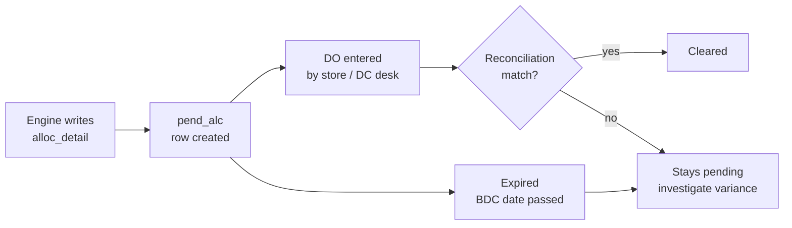

# Pending Allocation Lifecycle

> A row stays "pending" between the moment the engine writes it and the moment the store physically receives it. Pending is *not* a bug — it's the working state of every dispatch.

---

## The lifecycle

---

## Where each step lives in the UI

| Step | Where | Permission |
|---|---|---|
| See current pending pile | **Pending Allocation → Overview** | — |
| Manual pending entry (rare) | **Pending Allocation → Manual Entry** | — |
| DO posting per store | **Pending Allocation → Daily DO Entry** | — |
| Reconcile variance | **Pending Allocation → Reconciliation** | — |
| BDC date schedule | **Pending Allocation → BDC Schedule** | — |
| Schedule change audit | **Pending Allocation → Schedule Audit** | — |
| Full operations log | **Pending Allocation → Operations Log** | — |
| Report (Excel-style) | **Pending Allocation → Report** | `REPORTS_PEND_ALC` |

---

## Pending → FNL_Q (closing the loop)

This is the most important loop in the whole system to understand:

1. Engine writes `alloc_detail.allocated_qty = 50` for `(WERKS=S001, VAR=V123, SZ=M)`.
2. `pend_alc` gets a row with the same key + qty.
3. `MASTER_ALC_PEND` aggregates pending: `PEND_QTY[V123, M] = 50` (plus anything else outstanding).
4. **Next MSA run**: `FNL_Q[V123, M] = max(STK_QTY − PEND_QTY, 0)` — so the engine *won't double-allocate* the same pile.
5. Store posts DO → reconciliation clears the row → `PEND_QTY` drops back to 0.

> **If you skip step 5** (stale pending sitting in `MASTER_ALC_PEND`), the engine permanently sees a smaller pool and **under-allocates**. That's why reconciliation is a daily task, not a weekly one.

---

## BDC Schedule

**BDC = Bulk Delivery Cycle.** Each store has a delivery calendar. The schedule:

- decides when an allocation can ship to which store,
- gates the DO desk on what's allowed today,
- writes audit trail at **Schedule Audit** whenever a date moves.

If a row's BDC date passes without a DO posted, it goes back to "pending — schedule lapsed" and a planner must either re-schedule or cancel it.

---

## Reconciliation rules

A pending row clears when **all** of these match:

| Check | Tolerance |
|---|---|
| WERKS | exact |
| VAR_ART / SZ | exact |
| Qty | configurable tolerance, default exact |
| BDC window | DO date ≤ BDC date + grace |

Variances raise a **Reco exception**, visible on the Reconciliation page. Resolution paths:
- **Short ship** — write a credit, clear remaining pending.
- **Over ship** — write a debit, mark detail as fully cleared.
- **Wrong SKU** — manual reclassification; affects multiple `pend_alc` rows.

---

## Manual pending entry

Used when:
- A row was lost in a system outage and needs to be recreated.
- A planner wants to reserve stock against a known future need before the engine sees it.

The form writes directly to `pend_alc` with `source = MANUAL`. Manual rows go through the same reconciliation logic.

> **Heads up:** manual pending suppresses the same `FNL_Q` it would have suppressed if the engine had written it. Use sparingly — manual rows that never reconcile become permanent under-allocation.

---

## Operations log

The complete audit trail. Each row records:
- Action (CREATE, UPDATE, RECO, CANCEL, EXPIRE)
- Before / after values
- User + timestamp
- Linked DO number (if any)

This is the place to look when a number doesn't match what you expect.

---

## Read next

- **[Allocation Process](/process/allocation)** — what creates the pending rows in the first place.
- **[Variables Glossary](/process/variables)** — `PEND_QTY`, `FNL_Q`, `MASTER_ALC_PEND` defined.
