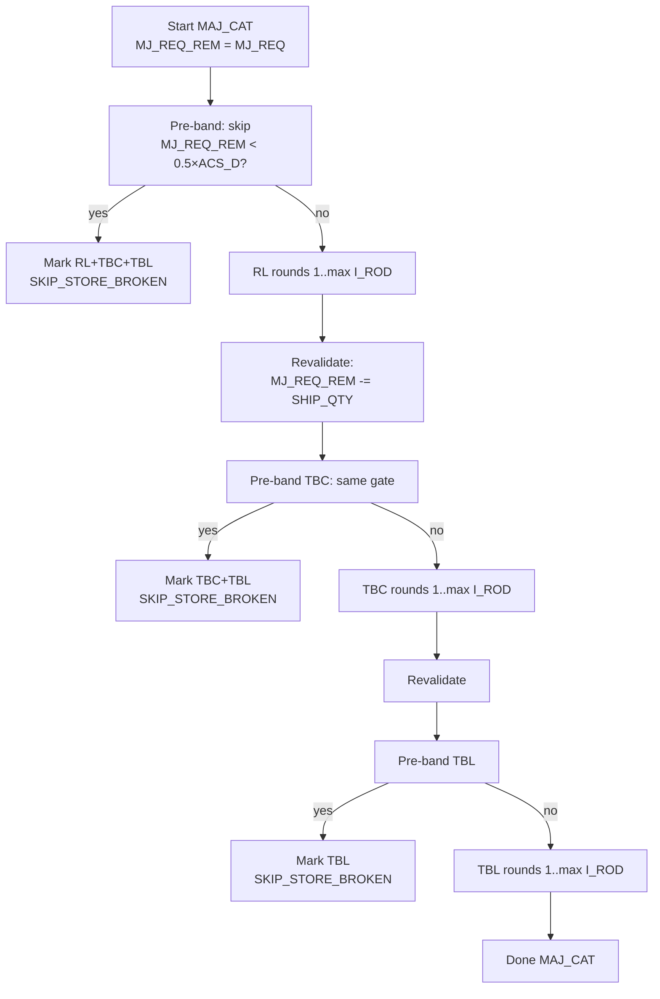

# Primary Cap & Secondary Cap (Sec-Cap)

> **Primary cap** = per-WERKS, per-MAJ_CAT ceiling. The big tap that controls how much each (store, category) can take.
>
> **Secondary cap** = per-grid bucket ceiling (FAB, MICRO_MVGR, MACRO_MVGR, RNG_SEG …). The smaller taps inside the big one.

---

## Primary cap — the MJ-grid

Two layers, one applied *during* the waterfall and one *after*.

### A. Live MBQ budget (during waterfall)

Inside `_run_majcat_waterfall` (file `rule_engine_pandas.py:1346-1424`), each band recomputes a per-WERKS budget:

```
budget = max(0, MJ_REQ_REM + ((cap_pct − 100) / 100) × MJ_MBQ_ORIG)
```

| `cap_pct` value | Result |
|---|---|
| **100 (default)** | Budget = `MJ_REQ_REM` → strict to plan. |
| **110**           | Budget = `MJ_REQ_REM + 10% × MJ_MBQ_ORIG` → 10% headroom on the *original* plan. |
| **130**           | Budget = `MJ_REQ_REM + 30% × MJ_MBQ_ORIG` → big headroom. |
| **0**             | Cap disabled — only `SZ_REQ` and pool limit the row. |
| **≤ 0**           | Same as 0 — disabled. |

`cap_pct` for an OPT is whichever of `rl_mbq_cap_pct` / `tbc_mbq_cap_pct` / `tbl_mbq_cap_pct` matches its OPT_TYPE.

> **Decision 4-B (2026-06 rollout):** the MBQ-cap formula now anchors to `MJ_MBQ_ORIG` (the snapshot taken *before* growth was applied), NOT the lifted `MJ_MBQ`.  Effect: per-OPT_TYPE dispatch caps operate on the original budget and are independent of the growth %.  Legacy deployments without `MJ_MBQ_ORIG` populated transparently fall back to live `MJ_MBQ`.
>
> **No separate RL/TBC/TBL sliders** (2026-06 UI revision): the three dispatch caps are derived per PRI ≥ 100% toggle state:
> - **PRI ≥ 100% (RL) ON (strict):** cap = `mj_req_growth_pct` (Grid MBQ Growth %).  When `Use Default 100% (MBQ)` is also ON, cap = 100.
> - **PRI ≥ 100% (RL) OFF (relaxed):** an inline "RL Dispatch Cap %" input surfaces next to the toggle.  Cap = that value × `MJ_MBQ_ORIG`.  Default 110 (range 50–200).
> - **PRI ≥ 100% (TBC):** same pattern as RL.
> - **TBL** has no PRI toggle; its cap always tracks `mj_req_growth_pct`.

### B. Post-waterfall hard ceiling

After the waterfall, Stage D applies a strict cap per OPT_TYPE per (WERKS, MAJ_CAT):

```
SUM(SHIP_QTY for OPT_TYPE)  ≤  cap_pct × MJ_REQ
```

| Setting | Default | Effect |
|---|---|---|
| `rl_mj_req_cap_pct`  | **100%** | RL ship total never exceeds `MJ_REQ`. |
| `tbc_mj_req_cap_pct` | **100%** | Same for TBC. |
| `tbl_mj_req_cap_pct` | **100%** | Same for TBL. |

`0` disables that gate completely. `100` is the hard ceiling at MAJ_CAT requirement.

### C. The 0.5 × ACS_D skip

Constant `ACS_SKIP_FACTOR = 0.5` (`rule_engine_new.py:48`). An OPT is marked SKIPPED in two places:

| Where | What it checks |
|---|---|
| `_pre_band_check` (rule_engine_pandas.py:1978) | If `MJ_REQ_REM < 0.5 × ACS_D` → this OPT and every later OPT_TYPE for this store are SKIPPED with `SKIP_STORE_BROKEN(mj_rem=X.X)`. |
| `_revalidate_after_band` (line 2233) | Same check after each band, prevents next round from spending into a broken store. |
| `H_*_REM` recompute (line 2147) | Grid is eligible only when `*_REQ_REM ≥ 0.5 × ACS_D`. |

> The user prompt's "0.5 × OPT_MBQ" is a shorthand for the same rule — for single-OPT MAJ_CATs `ACS_D ≈ OPT_MBQ`. The code uses `ACS_D`.

---

## Sequential RL → TBC → TBL gate



---

## Secondary cap (sec-cap)

> **Default:** `apply_sec_cap_in_normal = true` — sec-cap fires inside the main pass.

### Constants

- `SEC_CAP_DEFAULT_PCT = 130.0` (`rule_engine_new.py:3204`)
- Per-grid override: `ARS_GRID_BUILDER.sec_cap_pct` can override the global 130 for individual grids.
- **Effective cap formula (2026-06 update, Decision 2):**
  `effective_cap_pct = max(SEC_CAP_DEFAULT_PCT, mj_req_growth_pct)`
  → growth ≤ 130 keeps the cap at 130 (unchanged). Growth = 150 lifts the cap to 150. Growth REPLACES the 130% baseline when it's larger — caps don't stack.

### Primary grid inclusion (2026-06 update)

When the **Sec-Cap toggle is ON** (`apply_sec_cap_in_normal = True`, the default), the pre-gate now evaluates the **MJ Primary grid** in addition to every `grid_group='Secondary'` grid that has `sec_cap_applicable = 1`.  MJ's gate uses grain `(WERKS, MAJ_CAT)` and the same `effective_cap_pct` formula.

### The math

For each grid bucket (MJ when sec-cap is on, plus every Secondary grid with `sec_cap_applicable=1`):

```
ship_cap = (effective_cap_pct / 100) × *_MBQ_ORIG     (only when *_MBQ_ORIG > 0)
breach   = SUM(SHIP_QTY in bucket) − ship_cap
```

Note: the budget anchor is `*_MBQ_ORIG` (the pre-growth snapshot).  The growth is already baked into `effective_cap_pct` — so we read ORIG and multiply by the lifted cap %, never doubling up.  Legacy deployments without `*_MBQ_ORIG` transparently fall back to live `*_MBQ`.

If `breach > 0` and the OPT does **NOT** meet the high-demand override (`OPT_REQ ≥ SEC_CAP_PRE_OVERRIDE_OPT_REQ_PCT × OPT_MBQ`, default 100%), the entire OPT is blocked: `SHIP_QTY=0`, `ALLOC_STATUS='SKIPPED'`, `SKIP_REASON='SEC_CAP_PRE_<grid>(cap=NN%)'`.

### Critical rule — sparse MBQ

> **`*_MBQ = 0` means "no constraint at this grain", NOT "zero budget".**

If a bucket's `*_MBQ` is 0:
- The 1.30× math is **skipped** for that bucket.
- The row is bounded only by its primary grid + pool.
- Applying the 1.30× breach here would wrongly zero out legitimate ships.

### Grid extras propagation

For sec-cap to work, these 5 MP columns must flow through every hop:

```
ARS_LISTING → ARS_LISTING_WORKING → ARS_LISTED_OPT → ARS_ALLOC_WORKING
```

| Column | Used by |
|---|---|
| `FAB`           | `MJ_FAB` grid |
| `MACRO_MVGR`    | `MJ_MACRO_MVGR` grid |
| `MICRO_MVGR`    | `MJ_MICRO_MVGR` grid |
| `M_VND_CD`      | `MJ_M_VND_CD` grid |
| `RNG_SEG`       | `MJ_RNG_SEG` grid (this one is Primary, not Secondary) |

> **⚠️ If even one MP column drops out, sec-cap silently loses every grid that uses it, and over-allocation goes undetected.** Don't disable the `_FINAL_KEEP_COLS` guard in `listing.py:44-60`.

---

## Worked example — sec-cap pre-gate (2026-06 redesign)

**Setup:** MAJ_CAT = `MENS_DENIM`, single Secondary grid = `MJ_FAB`, `MJ_FAB_MBQ_ORIG = 100` for bucket `FAB=COTTON`.  Sec-Cap toggle is ON; growth_pct = 110% (so `effective_cap_pct = max(130, 110) = 130`).

OPTs walked in priority order. Per-grid running totals accumulate from admitted OPTs only.

| Step | OPT | OPT_TYPE | opt_ship | running_before | would_total | budget (130×ORIG/100) | Decision |
|---|---|---|---|---|---|---|---|
| 1 | A | RL  | 60 | 0  | 60  | 130 | **ADMIT** |
| 2 | B | RL  | 50 | 60 | 110 | 130 | **ADMIT** |
| 3 | C | TBC | 30 | 110 | 140 | 130 | **BLOCK** (no high-demand override) |
| 4 | D | TBL | 20 | 110 | 130 | 130 | **ADMIT** (fits exactly) |

**Final SHIP_QTY:**

| OPT | SHIP_QTY | SKIP_REASON | ALLOC_REMARKS |
|---|---|---|---|
| A | 60 | — | — |
| B | 50 | — | — |
| C |  0 | `SEC_CAP_PRE_MJ_FAB(cap=130%)` | `SEC_CAP_PRE_BLOCK(why="OPT would push grid MJ_FAB over its sec-cap ceiling", grid=MJ_FAB, cap=130%, before_ship=110, opt_ship=30, would_total=140, budget=130, exceeded_by=10, no_override=true);` |
| D | 20 | — | — |
| **Total** | **130** |  | matches cap ✓ |

**High-demand override example.** If OPT C had `OPT_REQ = 200` and `OPT_MBQ = 100` (so 200 ≥ 100% × 100), it would admit despite the breach, and the remark records:

```
SEC_CAP_PRE_OVERRIDE(why="high-demand OPT bypassed sec-cap (OPT_REQ >= 100% x OPT_MBQ)", grid=MJ_FAB, cap=130%, would_total=140, budget=130, opt_req=200, opt_mbq=100);
```

If instead `MJ_FAB_MBQ_ORIG = 0` (sparse), the bucket has *no constraint* — all four ship their full amounts.

---

## Read next

- **[Allocation Process](/process/allocation)** — what happens with the SHIP_QTY after caps.
- **[Variables Glossary](/process/variables)** — every cap-related variable defined.
