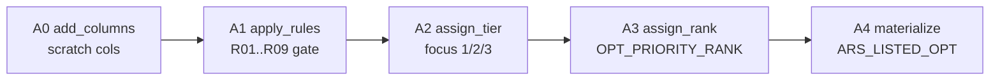

# Stage A — Rule Application & Ranking

> **Where we are in the pipeline:** Listing build produced `ARS_LISTING_WORKING` (one row per OPT = WERKS × MAJ_CAT × GEN_ART × CLR). Stage A decides **which OPTs are allowed to allocate** (the rule chain R01–R09) and **in what order** (the priority rank). Output table: `ARS_LISTED_OPT`.

**Table flow:** `ARS_LISTING` → `ARS_LISTING_WORKING` → **`ARS_LISTED_OPT`** (this stage) → `ARS_ALLOC_WORKING` (Stage B).

**Code:** production engine `rule_engine_pandas.py` delegates Stage A to `rule_engine_new.py` (imported as `rne`). Dispatch is `rule_engine_pandas.py:523-537`, which runs 5 functions in order:



**Module constants** (`rule_engine_new.py:31-48`): `R01,R02,R04,R05,R06,R07,R09 = True`; `R03=False`, `R08=False` (dead — see change notes); `ENABLE_FOCUS_TIERING=True`; `ACS_SKIP_FACTOR=0.5`.

---

## A0 — `_stage_a_add_columns` (`rule_engine_new.py:255-284`)

**What it does (layman):** makes sure the working table has the scratch columns Stage A needs, then wipes them so a re-run starts clean.

**Writes:** adds (if missing) to `ARS_LISTING_WORKING`: `LISTED_FLAG`, `LISTED_REASON`, `OPT_PRIORITY_RANK`, `OPT_PRIORITY_TIER`, `ALLOC_QTY`, `HOLD_QTY`, `ALLOC_STATUS`, `ALLOC_REMARKS`, `ALLOC_SEQ`. Then resets every row:

```sql
UPDATE [ARS_LISTING_WORKING] SET
  LISTED_FLAG=0, LISTED_REASON='',
  OPT_PRIORITY_RANK=NULL, OPT_PRIORITY_TIER=NULL,
  ALLOC_QTY=0, HOLD_QTY=0,
  ALLOC_STATUS='PENDING', ALLOC_REMARKS='', ALLOC_SEQ=NULL
```

> **⚠ Change note:** the `ALTER TABLE … ADD` is wrapped in a bare `except: pass` (`:274-275`). That hides a real failure (e.g. a permissions error) exactly the same as the harmless "column already exists" — and the missing column then blows up much later in A4. Narrow it to ignore only the "already exists" case.

---

## A1 — `_stage_a_apply_rules` (`rule_engine_new.py:287-392`) — the listing gate

**What it does (layman):** runs every OPT through a checklist (R01…R09). Each failed check appends a reason code to `LISTED_REASON`. **A row is listed (`LISTED_FLAG=1`) only if it passes every check** (reason string empty).

**Reads:** `LISTING`, `OPT_TYPE`, `MSA_FNL_Q`, `RL_HOLD_QTY`, `OPT_REQ_WH`, `PRI_CT%`, `ALLOC_FLAG`, `VAR_COUNT`, `VAR_FNL_COUNT`, `MJ_MBQ`, `MJ_STK_TTL`, `ACS_D`.
**Writes:** `LISTED_REASON`, `LISTED_FLAG`.

### The rule chain

| Rule | Drops the OPT when… | Plain English | Line |
|---|---|---|---|
| **R01_LISTING** | `TRY_CAST(LISTING AS INT) <> 1` | Not flagged listable by the planner. | 309 |
| **R02_NOT_MIX** | `OPT_TYPE = 'MIX'` | MIX rows never allocate. | 311 |
| ~~R03_NOT_NL~~ | *(disabled)* | NL handled upstream. | 313 |
| **R04_MSA_POS** | `MSA_FNL_Q <= 0 AND RL_HOLD_QTY <= 0` | No warehouse stock and no hold → nothing to ship. | 317 |
| **R05_REQ_POS** | `OPT_REQ_WH < 1` | Store needs less than 1 unit. | 323 |
| **R06_PRI_100** | `PRI_CT% < 100 AND ALLOC_FLAG <> 1 AND OPT_TYPE IN (enforced)` | Primary-grid coverage incomplete. | 325 |
| **R07_VAR_RATIO_TBL** | `OPT_TYPE='TBL' AND VAR_FNL_COUNT/VAR_COUNT < size_threshold AND VAR_FNL_COUNT < min_size_count` | New launch with too few sizes in stock. | 337 |
| ~~R08_MJ_REQ_BOOSTED~~ | *(disabled, merged into R09)* | — | 38 |
| **R09_HEADROOM_TRIVIAL** | `(MJ_MBQ × cap_factor − MJ_STK_TTL) < ACS_SKIP_FACTOR × NULLIF(ACS_D,0)` | MAJ_CAT headroom too small to bother. | 356 |

### R06 — who must have full primary coverage

```python
enforced = ['TBL']                       # TBL ALWAYS enforces PRI_CT% = 100
if pri_ct_check_rl:  enforced.append('RL')
if pri_ct_check_tbc: enforced.append('TBC')
```

Production defaults `pri_ct_check_rl = pri_ct_check_tbc = False`, so **only TBL** is forced to 100% primary coverage. Turn the toggles on to make RL / TBC strict too.

### R09 — the headroom gate (load-bearing)

```python
rl_factor  = (rl_mbq_cap_pct  / 100) if rl_mbq_cap_pct  > 0 else 1.0
tbc_factor = (tbc_mbq_cap_pct / 100) if tbc_mbq_cap_pct > 0 else 1.0
tbl_factor = (tbl_mbq_cap_pct / 100) if tbl_mbq_cap_pct > 0 else 1.0
# drop the OPT if:
#   MJ_MBQ × cap_factor − MJ_STK_TTL  <  0.5 × ISNULL(NULLIF(ACS_D,0),1)
```

- The cap factor scales the **MAJ_CAT-grain** budget (`MJ_MBQ`), per OPT_TYPE. It is **never** a per-OPT_TYPE total cap — growth lives at MJ + grid only.
- With production defaults (all caps `0` → factor `1.0`), R09 simplifies to: *list if `MJ_MBQ − MJ_STK_TTL ≥ 0.5 × ACS_D`.*

**Worked example (RL, defaults):**

| | Value |
|---|---|
| `MJ_MBQ` | 40 |
| `MJ_STK_TTL` | 36 |
| `ACS_D` | 18 |
| headroom = `40×1.0 − 36` | **4** |
| threshold = `0.5 × 18` | **9** |
| `4 < 9`? | **yes → dropped** with `R09_HEADROOM_TRIVIAL;` |

Now raise `rl_mbq_cap_pct` to 120: headroom = `40×1.2 − 36 = 12 ≥ 9` → **survives**.

> **Re-check after each OPT_TYPE:** `_check_r09_eligibility` (`:395-475`) re-runs the same predicate on `ARS_ALLOC_WORKING` after each waterfall, subtracting already-shipped qty (`Σ ALLOC_QTY` per WERKS,MAJ_CAT). It sets `ALLOC_STATUS='SKIPPED'` but **does not unset `LISTED_FLAG`** — Stage A's verdict is sticky.

**Knobs:** `size_threshold` (0.6) & `min_size_count` (3) → R07; `pri_ct_check_rl/tbc` → R06 scope; `rl/tbc/tbl_mbq_cap_pct` → R09 factor (raise = more OPTs survive); `ACS_SKIP_FACTOR` (0.5, hardcoded) → headroom floor.

> **Change notes:**
> - `ACS_SKIP_FACTOR=0.5` is a module constant but behaves like a business knob — **promote it to a UI setting** if Ops wants to tune how aggressively thin OPTs are dropped.
> - R09 defaults `ACS_D` to **1** (`:371`) but the Stage B MJ_REQ gate defaults it to **18** (`:806`). Same concept, two defaults — pick one.
> - R03 and R08 branches are **dead code** (flags hardcoded `False`).

---

## A2 — `_stage_a_assign_tier` (`rule_engine_new.py:478-488`)

**What it does (layman):** sorts the surviving OPTs into 3 focus tiers. Tier 1 ships first.

```sql
OPT_PRIORITY_TIER = CASE
  WHEN TRY_CAST(FOCUS_WO_CAP AS INT) = 1 THEN 1   -- focus, no cap
  WHEN TRY_CAST(FOCUS_W_CAP  AS INT) = 1 THEN 2   -- focus, with cap
  ELSE 3 END                                       -- regular
WHERE LISTED_FLAG = 1
```

This is the **only** place `FOCUS_W_CAP` / `FOCUS_WO_CAP` enter ranking. If `ENABLE_FOCUS_TIERING=False`, everything is tier 3.

---

## A3 — `_stage_a_assign_rank` (`rule_engine_new.py:491-534`)

**What it does (layman):** numbers the OPTs 1..N **within each `(WERKS, OPT_TYPE, MAJ_CAT)`** — a per-store, per-type priority list. This rank drives the waterfall draw order in Stage C. **It is not a global rank.**

```sql
ROW_NUMBER() OVER (
  PARTITION BY [WERKS], ISNULL([OPT_TYPE],''), [MAJ_CAT]
  ORDER BY
    ISNULL(OPT_PRIORITY_TIER, 3)          ASC,   -- 1. focus tier
    ISNULL(TRY_CAST([SEC_CT%] AS FLOAT),0) DESC,  -- 2. higher contribution % first
    ISNULL(MAX_DAILY_SALE, 0)             DESC,  -- 3. higher velocity first
    ISNULL(OPT_REQ_WH, 0)                 DESC,  -- 4. more required first
    GEN_ART_NUMBER                        ASC,   -- 5. stable tie-break
    ISNULL(CLR, '')                       ASC    -- 6. stable tie-break
)
```

- Velocity key is `MAX_DAILY_SALE` (correct — **not** `ACS_D`, which is density).
- `SIZE_RATIO` is **not** a ranking key; it is the R07 gate only.
- Identity tie-breakers (`GEN_ART_NUMBER`, `CLR`) make two identical runs produce identical ranks (determinism).

**Worked example** — store `HN14`, OPT_TYPE `RL`, MAJ_CAT `M_TEES_HS`:

| GEN_ART | TIER | SEC_CT% | MAX_DAILY_SALE | OPT_REQ_WH | → RANK |
|---|---|---|---|---|---|
| 1116111941 | 1 | 4.0 | 1.0 | 6 | **1** (tier 1 wins outright) |
| 1116111940 | 3 | 8.5 | 2.1 | 12 | 2 |
| 1116111942 | 3 | 8.5 | 2.1 | 9 | 3 (ties 940 until `OPT_REQ_WH` 9<12) |

### Re-rank at OPT_TYPE boundaries — `_rerank_for_next_opt_type` (`:537-636`)

Called between RL→TBC and TBC→TBL. Two steps:
1. **Live size-ratio skip** (`:567-600`): recompute SIZE_RATIO from **live** `FNL_Q_REM`; mark `ALLOC_STATUS='SKIPPED', reason=R07_SIZE_RATIO_LIVE` where coverage now too thin.
2. **Re-rank** survivors with the same ORDER BY, partitioned by `(WERKS, MAJ_CAT)` (OPT_TYPE pinned by WHERE).

> **Change note:** the sort is a fixed ORDER-BY sequence, not numeric weights — there is **no knob to weight velocity over contribution**. If Ops ever wants weighted OPT ranking, this is the spot (use the `req_weight`/`fill_weight` pattern from ST_RANK as precedent). Changing the partition grain here silently changes every downstream `ALLOC_QTY` — re-baseline before touching.

---

## A-aux — `ST_RANK` (computed upstream, NOT in Stage A) — `listing.py:1873-1934`

**What it does (layman):** ranks **stores** within a MAJ_CAT (1 = ships first on a tie). Used only as a cross-store tiebreaker in the waterfall.

```sql
FILL_RATE = CASE WHEN MJ_MBQ=0 THEN 0 ELSE ROUND(MJ_STK_TTL/MJ_MBQ,4) END
REQ_RANK  = DENSE_RANK() OVER (PARTITION BY MAJ_CAT ORDER BY MJ_REQ ASC)       -- low req = 1
FILL_RANK = DENSE_RANK() OVER (PARTITION BY MAJ_CAT ORDER BY FILL_RATE DESC)   -- high fill = 1
W_SCORE   = ROUND(REQ_RANK*req_weight + FILL_RANK*fill_weight, 2)              -- 0.4 / 0.6
ST_RANK   = ROW_NUMBER() OVER (PARTITION BY MAJ_CAT ORDER BY W_SCORE DESC, WERKS ASC)
```

**Knobs:** `req_weight` (0.4) raise → requirement dominates; `fill_weight` (0.6) raise → fill-rate dominates. Defaults at `listing.py:85-86`.

> **Direction matters:** `ST_RANK` orders by `W_SCORE DESC`, and the waterfall treats `ST_RANK` ascending as priority. Flipping the DESC/ASC would invert which store ships first on a tie — load-bearing.

---

## A4 — `_stage_a_materialize_listed` (`rule_engine_new.py:683-717`)

**What it does (layman):** writes the final `ARS_LISTED_OPT` = every `LISTED_FLAG=1` row, with a curated column set, NULLs defaulted to 0. This is the hand-off table to Stage B.

**Sec-cap propagation (critical):** `mp_cols = _collect_grid_extra_cols(...)` (`:690`) discovers each active grid's extra columns from `ARS_GRID_BUILDER` and injects them into the SELECT — this is what carries `FAB`, `MACRO_MVGR`, `MICRO_MVGR`, `M_VND_CD`, `RNG_SEG` forward. **If this breaks, `_apply_sec_grid_cap_pre_gate` silently drops grids.** Adding a new grid needs no code change here.

> **Change note:** to add a column for Stage C, you must add it **here AND in Stage B's SELECT**, or the alloc table won't have it.

---

## Change / upgrade summary for Stage A

| # | Finding | Action |
|---|---|---|
| 1 | `ACS_SKIP_FACTOR=0.5` hardcoded (`:48`) but acts as a business knob | Promote to UI setting |
| 2 | ACS_D default `1` (R09) vs `18` (Stage B gate) | Reconcile to one value |
| 3 | No weighted OPT ranking — fixed ORDER BY | Add weights if Ops asks |
| 4 | R03 / R08 dead code (flags `False`) | Remove or document |
| 5 | Bare `except: pass` on ALTER (`:274`) | Narrow to "already exists" |

---

**Next:** [Stage B — Explode to Variant × Size](/process/stage-b-explode)
