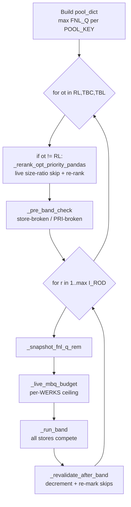

# Stage C — The Waterfall (the allocation core)

> **This is the heart of ARS.** Everything before this built the inputs; everything after just rounds and gates the output. The waterfall decides, unit by unit, which store gets which piece from the shared warehouse pool.

**Code:** `rule_engine_pandas.py` (the live path — UI defaults `allocation_mode=pandas`). Stages A/B run once in SQL; Stage C is ported to pandas, fanned out by MAJ_CAT across processes, then bulk-written back.

### Two grains you must keep straight

| Grain | Columns | Meaning |
|---|---|---|
| **POOL_KEYS** | `(RDC, MAJ_CAT, GEN_ART_NUMBER, CLR, VAR_ART, SZ)` | Warehouse pool — a regional RDC commodity **shared across all stores** fed by that RDC. |
| **OPT_KEYS** | `(WERKS, MAJ_CAT, GEN_ART_NUMBER, CLR)` | The store-level OPT identity. |

`WERKS` = store; `RDC` = warehouse feeding it. Pool is consumed at **RDC** grain; skip/requirement bookkeeping is at **WERKS** grain. This split is the single most important thing to keep straight when changing this code.

> **Why OPT uniqueness matters here:** `OPT_KEYS` does **not** include `OPT_TYPE`. The skip/revalidate joins by `OPT_KEYS` would be ambiguous if one `(WERKS,MAJ_CAT,GEN_ART,CLR)` carried two OPT_TYPEs. RL/TBC/TBL being mutually exclusive at OPT grain is what makes those joins correct.

**Constants:** `OPT_TYPE_ORDER=[RL,TBC,TBL]`, `ACS_SKIP_FACTOR=0.5`, `DEFAULT_WORKERS=4` (clamp 2–8), `PROCESS_POOL_MIN_MAJCATS=3`.

---

## The loop shape



**Order is OPT_TYPE-outer, round-inner:** RL completes *all* its rounds before TBC starts; within RL, round 1 finishes for *all* stores before round 2.

---

## `_live_mbq_budget` — the per-store ceiling

The budget that caps how much a store can take in a band:

```python
budget(WERKS) = max(0, MJ_REQ_REM + ((cap_pct − 100) / 100) × MJ_MBQ)
```

| `cap_pct` | Budget | Meaning |
|---|---|---|
| **100** | `MJ_REQ_REM` | strict to remaining requirement |
| **130** | `MJ_REQ_REM + 0.30 × MJ_MBQ` | 30% headroom on plan |
| **≤ 0** | `{}` (empty) | **cap disabled** — bounded only by `SZ_REQ` and pool |

Rebuilt fresh **every band** from the *live* `MJ_REQ_REM` (which `_revalidate` decrements), so it reflects everything shipped by prior OPT_TYPEs and prior rounds with no double-counting.

Effective cap per type (`_run_majcat_waterfall:1336`):
```python
eff_rl_cap  = 100.0 if pri_ct_check_rl  else rl_mbq_cap_pct
eff_tbc_cap = 100.0 if pri_ct_check_tbc else tbc_mbq_cap_pct
eff_tbl_cap = tbl_mbq_cap_pct        # TBL MJ-cap removed 2026-05-16; usually 0 = uncapped
```

> **Change note:** `_build_mbq_budget` (line 1215) is **dead code** — `_live_mbq_budget` is used everywhere, and the dead one's formula differs (misleading). Remove or mark superseded.

---

## `_pre_band_check` — who is skipped before the band

Runs **once per OPT_TYPE**, before round 1. Two skip rules:

**Rule 1 — PRI broken** (enforced types only): `PRI_CT_REM < 100` → `SKIP_PRI_BROKEN(pri=…)`.
```python
enforced = {'TBL'}                       # TBL ALWAYS enforced
if pri_ct_check_rl:  enforced.add('RL')
if pri_ct_check_tbc: enforced.add('TBC')
```

**Rule 2 — store broken (the 0.5×ACS_D gate)**, applied to the current type **and all later types**:
```python
sb_mask = MJ_REQ_REM < ACS_SKIP_FACTOR × ACS_D     # 0.5 × ACS_D
# → SKIP_STORE_BROKEN(mj_rem=…)
```

Plain English: *"a store with less than half-a-display worth of remaining MAJ_CAT need is broken — stop allocating to it for this and all lower-priority types."*

> **ACS_D used correctly as density** (the half-display floor), **not** as velocity. Velocity (`MAX_DAILY_SALE`) is only used in ranking.

---

## `_run_band` — one round × one type, all stores compete

The actual allocation. Vectorised; all stores compete simultaneously for the shared pool.

### need calculation
```python
need_ship = max(r × SZ_MBQ − SZ_STK − SHIP_QTY, 0)        # cumulative target this round
# pool need:
RL/TBC:  need_pool = max(r × SZ_MBQ − SZ_STK − POOL_CONSUMED, 0)
TBL:     tbl_cum   = SZ_MBQ_WH + (r−1) × SZ_MBQ           # WH buffer counted once
         need_pool = max(tbl_cum − SZ_STK − POOL_CONSUMED, 0)
         need_pool = 0 if need_ship == 0                  # don't draw pool just to build hold
```

### Step 1b — RL/TBC draw warehouse-hold FIRST
```python
if ot in (RL, TBC) and hold_dict:
    from_hold = min(need_pool, hold_avail[(WERKS,VAR_ART,SZ)])
    SHIP_QTY += from_hold;  FROM_HOLD_QTY += from_hold
    need_pool -= from_hold
```
TBL does **not** draw hold here — it *creates* hold via the split below.

### Steps 3-5 — priority draw from the shared pool
```python
sort: POOL_KEYS + [OPT_PRIORITY_RANK, ST_RANK(NaN→999999), WERKS]   # stable mergesort
cum_prev   = cumulative need of higher-priority rows in this pool key
remaining  = max(FNL_Q_REM − cum_prev, 0)
take_pool  = min(remaining, need_pool)                  # highest priority eats pool first
```

### Step 5a — per-WERKS MBQ cap (shared across a store's OPTs)
```python
# re-sort by (WERKS, OPT_PRIORITY_RANK): highest-priority OPT at a store eats budget first
_row_rem  = max(budget(WERKS) − cum_take_at_store, 0)
take_pool = min(take_pool, _row_rem)
# skipped entirely when mbq_budget == {} (cap disabled, e.g. TBL)
```

### Step 6 — SHIP vs HOLD split
```python
TBL:     round_ship = min(take, need_ship);  round_hold = max(take − need_ship, 0)
RL/TBC:  round_ship = take;                  round_hold = 0
```
The hold buffer is **TBL-only**. `ALLOC_STATUS` compares cumulative **SHIP_QTY** (not ship+hold) to target — hold never makes a row ALLOCATED.

### The audit trace token
```
B[RL.r1.rk1] sh=5 hld=0 pool=120->115;
```
`rk` = OPT_PRIORITY_RANK; `pool=before->after`. (Hold draws use `B[RL.r1.rk1] from_hold=3;`.)

> **🔴 Tightest coupling in the file:** this token is parsed back by `_BAND_TRACE_RE` (line 2317) during PAK rounding. **If you change the token format in `_run_band`, you must update that regex in lockstep** or post-PAK remark rewriting silently no-ops.

---

## `_revalidate_after_band` — decrement & re-mark

Runs after every band. Early-exits if nothing shipped.

1. **MSA_FNL_Q_REM** −= (ship + hold) per OPT.
2. **Each grid's `*_REQ_REM`** −= `ROUND_SHIP` (ship only, **not** hold) at the grid grain.
3. **`H_*_REM` = 1** iff `*_REQ_REM >= 0.5 × ACS_D` AND `GH_* == 1`.
4. **`PRI_CT_REM` = Σ(H_REM) / Σ(GH) × 100**.
5. **Skip rules** scoped to OPTs that still have a next band (`I_ROD >= r+1`):
   - `MSA_FNL_Q_REM <= 0` → `SKIP_MSA_EXHAUSTED`
   - `MJ_REQ_REM <= 0` → `SKIP_MJ_EXHAUSTED` *(prevents round r+1 over-shipping past satisfied requirement)*
   - `PRI_CT_REM < 100` (enforced) → `SKIP_PRI_BROKEN`
   - `MJ_REQ_REM < 0.5×ACS_D` → `SKIP_STORE_BROKEN`
6. **Propagate skips to alloc** — and crucially, **re-mark exhausted PARTIAL rows as SKIPPED**.

> **🔴 PARTIAL re-admission risk:** `_run_band`'s eligibility gate excludes only SKIPPED/INELIGIBLE — **not PARTIAL**. The *only* thing stopping a PARTIAL row from over-shipping next round is step 6 here. If you ever disable revalidation (`ENABLE_PER_OPT_REVALIDATION=False`) without a replacement gate, rounds over-ship past `MJ_REQ`.

> **⚠ Sec-cap propagation choke point:** step 2 has `if not all(e in work_cols for e in extras): continue` (line 2095). A missing extra column does **not** error — it silently skips the grid decrement, so sec-cap loses that grid with no log. Verify `FAB/MACRO_MVGR/MICRO_MVGR/M_VND_CD/RNG_SEG` reach `working_df`; consider adding a warning.

---

## `_rerank_opt_priority_pandas` — live re-rank for TBC/TBL

Runs at the start of TBC and TBL (not RL). Two steps:
1. **Skip** OPTs with thin live coverage: `SIZE_RATIO < size_threshold AND sizes_with_pool < min_size_count` (both) → `R07_SIZE_RATIO_LIVE`.
2. **Re-rank** survivors by live data: `TIER ASC → SIZE_RATIO DESC → SEC_CT% DESC → MAX_DAILY_SALE DESC → OPT_REQ_WH DESC → (GEN_ART, CLR)`.

> **Change note:** the `.apply(axis=1)` rank lookup (line 1544) is the one non-vectorised hotspot — replace with a tuple-keyed `.map` for large MAJ_CATs.

---

## Worked example — 1 MAJ_CAT, 3 OPTs (RL, TBC, TBL)

> Synthetic but follows the exact arithmetic. One MAJ_CAT, one RDC `R01`, three stores. `I_ROD=2` (two rounds) for all. `ACS_D=4` → store-broken floor `0.5×4 = 2`. Caps: `rl=130, tbc=130, tbl=0` (TBL uncapped). No hold.

| OPT | WERKS | TYPE | SZ_MBQ | SZ_MBQ_WH | SZ_STK | MJ_MBQ | MJ_REQ_REM(init) |
|---|---|---|---|---|---|---|---|
| RL  | S1 | RL  | 5 | – | 1 | 10 | 9 |
| TBC | S2 | TBC | 4 | – | 0 | 8  | 8 |
| TBL | S3 | TBL | 3 | 6 | 0 | 6  | 6 |

**Pool** (all share one POOL_KEY) = `max(FNL_Q) = 20`.

### RL — round 1
- budget(S1) = `max(0, 9 + 0.30×10) = 12`
- `need_ship = max(1×5 − 1 − 0, 0) = 4`; pool take = `min(20, 4) = 4`; budget allows 12 → ship **4**
- SHIP_QTY 0→4; target = `2×5−1 = 9`; 4 < 9 → **PARTIAL**; pool 20→16
- trace: `B[RL.r1.rk1] sh=4 hld=0 pool=20->16;`
- revalidate: MJ_REQ_REM 9→**5**; PRI 100; not store-broken → survives

### RL — round 2
- budget(S1) = `max(0, 5 + 0.30×10) = 8`
- `need_ship = max(2×5 − 1 − 4, 0) = 5`; take = `min(16, 5) = 5`; budget 8 → ship **5**
- SHIP_QTY 4→**9**; 9 ≥ 9 → **ALLOCATED**; pool 16→11
- revalidate: MJ_REQ_REM 5→**0**

### TBC — round 1 (rerank ok, not store-broken: 8 ≥ 2)
- budget(S2) = `max(0, 8 + 0.30×8) = 10.4`
- `need_ship = max(1×4 − 0, 0) = 4`; take = `min(11, 4) = 4` → ship **4**
- SHIP_QTY 0→4; target = `2×4 = 8`; 4 < 8 → **PARTIAL**; pool 11→7
- revalidate: MJ_REQ_REM 8→**4**

### TBC — round 2
- budget(S2) = `max(0, 4 + 0.30×8) = 6.4`
- `need_ship = max(2×4 − 0 − 4, 0) = 4`; take = `min(7, 4) = 4` → ship **4**
- SHIP_QTY 4→**8**; 8 ≥ 8 → **ALLOCATED**; pool 7→3
- revalidate: MJ_REQ_REM 4→**0**. **Pool now = 3.**

### TBL — round 1 (cap disabled, TBL always PRI-enforced; not store-broken: 6 ≥ 2)
- `need_ship = max(1×3 − 0, 0) = 3`; `tbl_cum = 6 + 0 = 6`; `need_pool = 6`
- pool only **3** left → take = `min(3, 6) = 3`; split: ship `min(3,3)=3`, hold 0
- SHIP_QTY 0→3; target = `2×3 = 6`; 3 < 6 → **PARTIAL**; pool 3→0
- revalidate: MJ_REQ_REM 6→3; survives to round 2 (but pool is 0)

### TBL — round 2
- pool lookup = **0** → row dropped, `_run_band` returns early. No ship. TBL ends **PARTIAL** at SHIP=3.

### Result

| OPT | SHIP | STATUS | Why |
|---|---|---|---|
| RL (S1)  | 9 | ALLOCATED | got full requirement |
| TBC (S2) | 8 | ALLOCATED | got full requirement |
| TBL (S3) | 3 | PARTIAL | **pool-starved** — RL+TBC drained 17 of 20 first |

**Total ship = 20 = full pool.** TBL wasn't skipped by a rule — it was starved by priority order (RL → TBC → TBL). To see an explicit `SKIP_STORE_BROKEN`, lower TBL's `MJ_REQ_REM` below 2; to see `SKIP_MJ_EXHAUSTED`, give TBL enough pool to drive its `MJ_REQ_REM` to 0 in round 1.

---

## Knobs (effect of changing)

| Knob | Default | Effect |
|---|---|---|
| `pri_ct_check_rl` / `pri_ct_check_tbc` | off | **On** pins that type's cap to 100% (no headroom) AND drops PRI-broken OPTs. Strictest mode. TBL PRI is always on. |
| `rl/tbc/tbl_mbq_cap_pct` | 0 | Per-type growth headroom. `130` = +30% of MJ_MBQ. `≤0` = no MJ ceiling (TBL default). Independent per type — no global MAJ_CAT total cap. |
| `mj_req_growth_pct` | 100 | **Applied upstream in `listing.py`** (scales MJ_MBQ→MJ_REQ). Raising → bigger budget → more ship. Engine-side it's informational only. |
| `n_workers` | 4 (2–8) | More parallel MAJ_CATs. Capped at 8 (CPU-bound; over-fanning starves foreground requests). |
| `use_writer_queue` | env | On = single writer thread, zero writer-writer deadlocks. Only engages when pooling. |
| `size_threshold` / `min_size_count` | 0.6 / 3 | R07 gate. Skip only when ratio < threshold **AND** sizes < min (both). Raising = stricter coverage. |
| `hold_days` / hold tracking | — | RL/TBC ship from warehouse hold before pool; TBL creates hold. |

---

## Change / upgrade summary for Stage C

| # | Finding | Severity |
|---|---|---|
| 1 | Trace token ↔ `_BAND_TRACE_RE` lockstep coupling | 🔴 update together |
| 2 | PARTIAL re-admission relies entirely on revalidation step 6 | 🔴 don't disable reval |
| 3 | Sec-cap grid silently skipped if extras missing (line 2095) | ⚠ add warning |
| 4 | `int(NaN)` on `max_round` if I_ROD all-NaN (line 1350) | ⚠ defensive coerce |
| 5 | `_build_mbq_budget` dead code, misleading formula | cleanup |
| 6 | `_rerank` `.apply(axis=1)` is the slow hotspot | perf |
| 7 | `ACS_SKIP_FACTOR=0.5`, `999999` sentinel hardcoded | promote to config |

**Race safety:** each MAJ_CAT is a disjoint slice in its own process — no shared mutable state on the hot path. Only DB write-back contends, handled by `retry_on_deadlock` or the single writer thread.

---

**Next:** [Stage D — Finalize](/process/stage-d-finalize) · **Prev:** [Stage B — Explode](/process/stage-b-explode)
