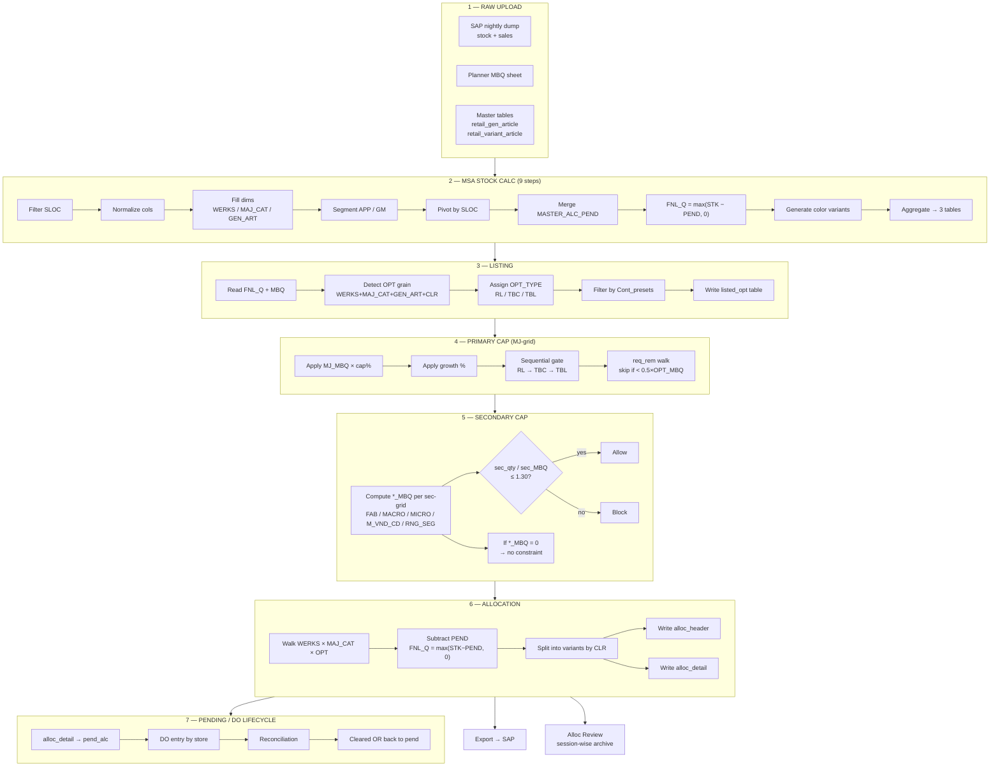
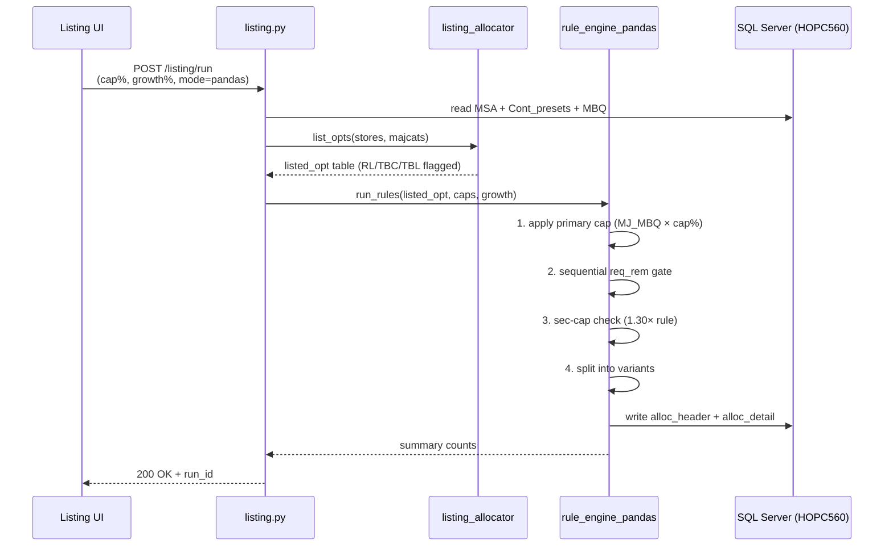

# Full Workflow Chart

> The complete journey of a piece of stock — from SAP nightly dump to a store-bound DO.

---

## End-to-end pipeline

---

## Where each stage runs in code

| Stage | File | Function |
|---|---|---|
| MSA | `backend/app/services/msa_service.py` | `run_msa()` (9 steps) |
| Listing | `backend/app/services/listing_allocator.py` | `list_opts()` |
| Listing API | `backend/app/api/v1/endpoints/listing.py` | POST `/listing/run` |
| Primary cap + sec-cap + alloc | `backend/app/services/rule_engine_pandas.py` | `run_rules()` |
| Archive | `backend/app/services/parked_history.py` | session snapshot |

> **Pandas is the production default** — `rule_engine_pandas.py` is the live path. The other engines (`rule_engine_new.py`, `rule_engine_parallel_sql.py`, `rule_engine_parallel_python.py`) exist for benchmarking only.

---

## How a single OPT flows through

---

## Read-this-next

- **[Listing Process](/process/listing)** — what makes an OPT eligible
- **[Primary & Sec-Cap](/process/sec-cap)** — math behind the caps
- **[Allocation Process](/process/allocation)** — how `alloc_detail` is built
